# Official Homey GitHub Actions Workflows

**Last Updated:** 2025-10-13  
**Status:** ✅ Production Ready

---

## 🎯 Active Workflows

### 1. **homey-official-publish.yml** (PRIMARY)

**Trigger:** Push to `master` branch  
**Purpose:** Official Homey App Store publication

**Uses Official GitHub Actions:**
- ✅ [`athombv/github-action-homey-app-validate@v1`](https://github.com/marketplace/actions/homey-app-validate)
- ✅ [`athombv/github-action-homey-app-update-version@v1`](https://github.com/marketplace/actions/homey-app-update-version)
- ✅ [`athombv/github-action-homey-app-publish@v1`](https://github.com/marketplace/actions/homey-app-publish)

**Jobs:**
1. **Validate** - Runs `homey app validate --level publish`
2. **Version** - Auto-increments patch version
3. **Publish** - Publishes to Homey App Store

**Requirements:**
- `HOMEY_TOKEN` secret must be set in repository settings

**Dashboard:**
- https://tools.developer.homey.app/apps

---

### 2. **homey-validate-only.yml**

**Trigger:** Pull requests to `master` or `develop`  
**Purpose:** Validation without publishing

**Validation Levels:**
- ✅ `publish` - Required for App Store
- ✅ `verified` - Required for verified developers

**Use Case:** Pre-merge validation in PRs

---

### 3. **weekly-enrichment.yml**

**Trigger:** Weekly schedule + manual  
**Purpose:** Device database enrichment

**Status:** Active (non-publishing workflow)

---

### 4. **ai-weekly-enrichment.yml**

**Trigger:** Weekly schedule + manual  
**Purpose:** AI-assisted device enrichment

**Status:** Active (non-publishing workflow)

---

## 📚 Documentation Reference

**Official Homey SDK Documentation:**
- **Publishing Guide:** https://apps-sdk-v3.developer.homey.app/App%20Store/Publishing
- **Guidelines:** https://apps.developer.homey.app/app-store/guidelines
- **Developer Tools:** https://tools.developer.homey.app

**GitHub Marketplace Actions:**
1. **Validate:** https://github.com/marketplace/actions/homey-app-validate
2. **Update Version:** https://github.com/marketplace/actions/homey-app-update-version
3. **Publish:** https://github.com/marketplace/actions/homey-app-publish

---

## 🔧 Configuration

### Required Secrets

Go to: **Repository Settings → Secrets and variables → Actions**

| Secret Name | Description | How to Get |
|-------------|-------------|------------|
| `HOMEY_TOKEN` | Homey API Token | https://tools.developer.homey.app/tools/api |

**To create HOMEY_TOKEN:**
1. Go to https://tools.developer.homey.app/tools/api
2. Click "Create Token"
3. Copy the token
4. Add as repository secret named `HOMEY_TOKEN`

---

## 🚀 Usage

### Automatic Publication (Recommended)

Simply push to `master` branch:

```bash
git add -A
git commit -m "Your commit message"
git push origin master
```

The workflow will automatically:
1. ✅ Validate the app
2. ✅ Increment version (patch)
3. ✅ Publish to Homey App Store
4. ✅ Create changelog

### Manual Publication

Trigger manually from GitHub Actions tab:
1. Go to **Actions** tab
2. Select **Homey App - Official Publish**
3. Click **Run workflow**
4. Select `master` branch
5. Click **Run workflow**

### Validation Only

For pull requests:
- Automatically runs on PR creation
- Validates at both `publish` and `verified` levels
- Must pass before merge

---

## 📊 Workflow Execution Flow

```mermaid
graph TD
    A[Push to master] --> B[Validate Job]
    B --> C{Validation OK?}
    C -->|Yes| D[Update Version Job]
    C -->|No| E[❌ Fail - Fix errors]
    D --> F[Increment patch version]
    F --> G[Commit version change]
    G --> H[Publish Job]
    H --> I[Pull latest changes]
    I --> J[Publish to Homey App Store]
    J --> K{Publish OK?}
    K -->|Yes| L[✅ Success - App published]
    K -->|No| M[❌ Fail - Check logs]
```



---

## 🎯 Validation Levels

### Debug Level
```bash
homey app validate --level debug
```
- Used during development
- Various properties optional
- Not suitable for publishing

### Publish Level (Default)
```bash
homey app validate --level publish
```
- ✅ Required for Homey App Store
- All images, brandColor, category required
- Used in workflows

### Verified Level
```bash
homey app validate --level verified
```
- ✅ Required for verified developers
- Additional requirements: platforms, connectivity, support
- Used for Homey Cloud compatibility

---

## 🔍 Troubleshooting

### Workflow Fails at Validate

**Error:** Validation errors

**Solution:**
```bash
# Run locally to see errors
homey app validate --level publish

# Fix errors and commit
git add -A
git commit -m "fix: validation errors"
git push origin master
```

### Workflow Fails at Publish

**Error:** `HOMEY_API_TOKEN not found`

**Solution:**
1. Check secret name is exactly `HOMEY_TOKEN`
2. Regenerate token at https://tools.developer.homey.app/tools/api
3. Update repository secret

**Error:** `App already published with this version`

**Solution:**
- Version auto-increment failed
- Manually bump version in `app.json`
- Commit and push again

### Workflow Doesn't Trigger

**Check:**
1. File is named `*.yml` (not `*.yml.disabled`)
2. File is in `.github/workflows/` directory
3. Push is to `master` branch
4. Changes are not in ignored paths

---

## 📋 Migration from Old Workflows

### Old Workflows (Disabled)

The following workflows have been replaced:
- ❌ `auto-publish-complete.yml.disabled`
- ❌ `homey-app-store.yml.disabled`
- ❌ `homey-publish-simple.yml`
- ❌ `auto-driver-publish.yml`

**Why replaced?**
- Used custom scripts instead of official actions
- Complex error handling
- Buffer overflow issues
- Not maintained by Athom

### New Approach (Active)

- ✅ Uses official Athom GitHub Actions
- ✅ Maintained and updated by Athom
- ✅ Simpler configuration
- ✅ Better error messages
- ✅ Automatic version management

---

## 📈 Success Metrics

### Expected Results

After push to `master`:

1. **Within 2 minutes:** Validation complete
2. **Within 3 minutes:** Version updated
3. **Within 5 minutes:** Published to Homey App Store
4. **Within 10 minutes:** Available in dashboard

### Monitoring

**GitHub Actions:**
- https://github.com/dlnraja/com.tuya.zigbee/actions

**Homey Dashboard:**
- https://tools.developer.homey.app/apps/app/com.dlnraja.tuya.zigbee

**Expected Status:**
- ✅ Green checkmarks on all jobs
- ✅ New version visible in dashboard
- ✅ App available for testing

---

## 🛠 Advanced Configuration

### Custom Changelog

Edit `changelog` in `homey-official-publish.yml`:

```yaml
changelog: |
  v${{ needs.version.outputs.version }} - Your custom changelog
  
  ✅ New features
  🐛 Bug fixes
  ⚡ Performance improvements
```

### Version Type

Change version increment type:

```yaml
- name: Update version
  uses: athombv/github-action-homey-app-update-version@v1
  with:
    type: minor  # Options: major, minor, patch
```

### Conditional Publishing

Add conditions to publish job:

```yaml
publish:
  if: contains(github.event.head_commit.message, '[publish]')
  # Only publishes if commit message contains [publish]
```

---

## 📞 Support

### Official Resources

- **Homey SDK Docs:** https://apps-sdk-v3.developer.homey.app
- **GitHub Actions:** https://github.com/marketplace?query=homey
- **Developer Tools:** https://tools.developer.homey.app

### Community

- **Forum Thread:** https://community.homey.app/t/app-pro-universal-tuya-zigbee-device-app-lite-version/140352
- **GitHub Issues:** https://github.com/dlnraja/com.tuya.zigbee/issues

---

## ✅ Checklist Before First Run

- [ ] `HOMEY_TOKEN` secret added to repository
- [ ] App validated locally: `homey app validate --level publish`
- [ ] Changes committed to `master` branch
- [ ] Workflow file is `*.yml` (not disabled)
- [ ] No syntax errors in YAML
- [ ] All required fields in `app.json`
- [ ] Images meet Homey requirements

---

**Last Validation:** 2025-10-13  
**Status:** ✅ Production Ready  
**Workflow Version:** v1.0.0
