# 🔄 GitHub Actions Workflows

## Active Workflow

### 🚀 `publish-auto.yml` - Automatic Publication
**Status:** ✅ Active  
**Trigger:** Push to master, Manual dispatch

**Features:**
- ✅ Automatic validation (SDK3)
- ✅ Auto-generated changelog from commits
- ✅ Intelligent version bumping
- ✅ Homey App Store publication
- ✅ GitHub Release creation

**Version Detection:**
- `BREAKING` or `major:` prefix → **major** bump
- `feat` or `minor:` prefix → **minor** bump
- Others → **patch** bump

**Required Secrets:**
- `HOMEY_PAT`: Personal Access Token from https://tools.developer.homey.app/me

**Actions Used:**
- `athombv/github-action-homey-app-validate@master`
- `athombv/github-action-homey-app-version@master`
- `athombv/github-action-homey-app-publish@master`

---

## Deprecated Workflows

These workflows are kept for reference but are not active:

- `homey-official.yml` - Old CLI-based publication
- `homey-publish-fixed.yml` - Expect-based automation
- `publish-clean.yml` - Manual cleanup approach
- `publish-homey.yml` - Simple publication
- `publish-main.yml` - Main publication method
- `publish-sdk3.yml` - SDK3-specific publication
- `manual-publish.yml` - Manual trigger only
- `test-cli.yml` - CLI testing

---

## Monthly Workflow

### 📅 `monthly-auto-enrichment.yml`
**Status:** ✅ Active  
**Trigger:** Monthly schedule (1st of month)

Automatic enrichment and updates from external sources.

---

## Workflow Execution Flow

```mermaid
graph TD
    A[Push to master] --> B[Checkout Code]
    B --> C[Validate App SDK3]
    C --> D{Valid?}
    D -->|No| E[❌ Fail]
    D -->|Yes| F[Generate Changelog]
    F --> G[Detect Version Bump]
    G --> H[Update Version]
    H --> I[Commit & Tag]
    I --> J[Publish to Homey]
    J --> K[Create GitHub Release]
    K --> L[✅ Success]
```



---

## Commit Message Format

For automatic version detection:

```bash
# Patch bump (default)
git commit -m "fix: correction images"
git commit -m "docs: update README"

# Minor bump
git commit -m "feat: nouvelle fonctionnalité"
git commit -m "feature: add new driver"
git commit -m "minor: improvements"

# Major bump
git commit -m "BREAKING: incompatible changes"
git commit -m "major: complete rewrite"
```

---

## Manual Publication

Trigger via GitHub UI:
1. Go to **Actions** tab
2. Select **Publish to Homey App Store**
3. Click **Run workflow**
4. Choose version bump: `patch`, `minor`, or `major`
5. Click **Run workflow** again

---

## Monitoring

- **GitHub Actions**: https://github.com/dlnraja/com.tuya.zigbee/actions
- **Homey Dashboard**: https://tools.developer.homey.app/apps/app/com.dlnraja.tuya.zigbee
- **App Store**: https://homey.app/apps/com.dlnraja.tuya.zigbee

---

## Troubleshooting

### Validation Fails
- Check `homey app validate` locally
- Verify SDK3 compliance
- Check driver images (75x75, 500x500, 1000x1000)

### Publication Fails
- Verify `HOMEY_PAT` secret is configured
- Check token at https://tools.developer.homey.app/me
- Ensure version number is higher than current

### No Changelog
- Ensure commits since last tag
- Check commit message format
- Verify git history

---

## Configuration

### Required Repository Secrets

Navigate to: **Settings → Secrets and variables → Actions**

| Secret | Value | Source |
|--------|-------|--------|
| `HOMEY_PAT` | Personal Access Token | https://tools.developer.homey.app/me |

### Required Permissions

In workflow file:
```yaml
permissions:
  contents: write  # For commits, tags, releases
```
