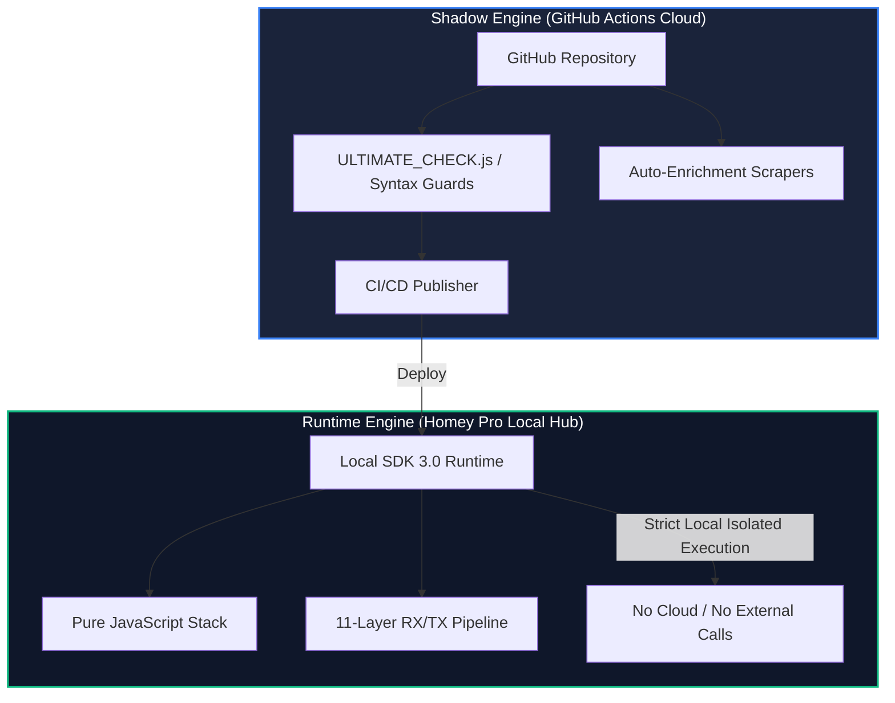
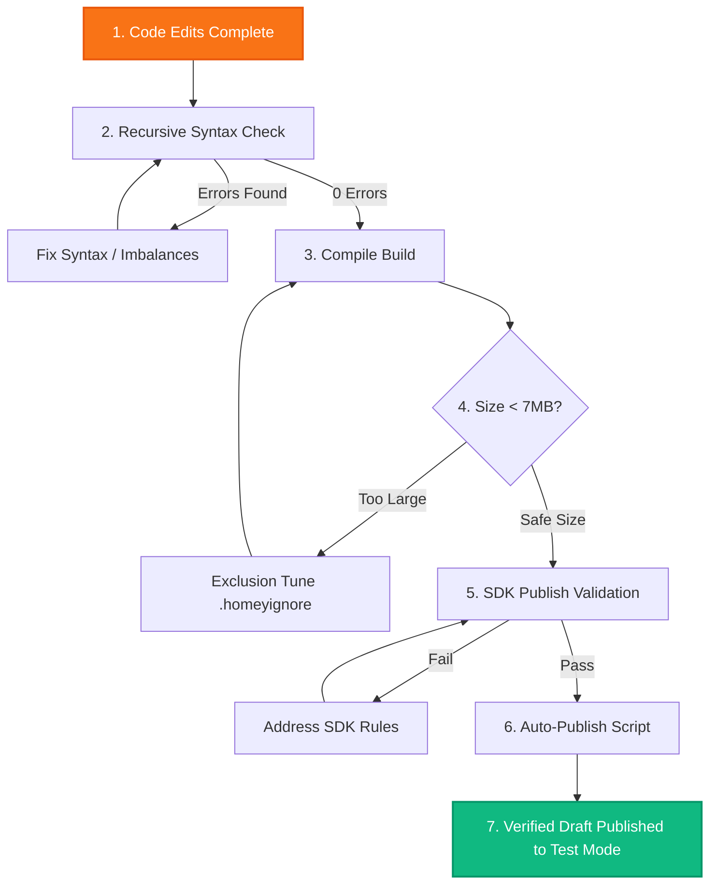

# Universal Tuya Engine - AI & Developer Context Mandate
> [!IMPORTANT]
> **CRITICAL MANDATE FOR ALL AI AGENTS & DEVELOPERS:**
> Before proposing any code modification, adding a driver, or executing a task in this repository, you **MUST** read this context file in its entirety. This document acts as the single source of truth for the codebase architecture, historical evolutions, dual-app deployment mechanics, and strict validation requirements. **DO NOT DEVIATE** from the protocols and structures defined here.
> 
> **MANDATORY SECOND STEP**: After reading this mandate, you **MUST** read [GLOBAL_INVESTIGATION_PLAN.md](docs/GLOBAL_INVESTIGATION_PLAN.md) — the complete 22-section investigation methodology for deep diagnostic, cross-referencing forums/emails/GitHub/Z2M/ZHA, bug hunting, and prevention scripting. It is the operational companion to this architectural mandate.

---

## 🗺️ 1. Dual-App Split & Branch Cartography

The repository maintains two parallel, completely independent app environments targeting different developer and production user segments in Athom's App Store.

| App ID | Branch | Intended Audience | Versioning Style | Test Channel URL |
| :--- | :--- | :--- | :--- | :--- |
| `com.dlnraja.tuya.zigbee` | `master` | Experimental / Beta Test Users | `7.x.x` (e.g., `7.5.38`) | [Tuya Unified Beta](https://homey.app/a/com.dlnraja.tuya.zigbee/test/) |
| `com.dlnraja.tuya.zigbee.stable` | `stable-v5` | Production / Stable Users | `5.x.x` (e.g., `5.11.216`) | [Tuya Unified Stable](https://homey.app/a/com.dlnraja.tuya.zigbee.stable/test/) |

### ⚠️ Critical Dual-App Publishing Rules:
1. **Hermetic Branch Separation**: Modifications meant for the stable experience must be made on `stable-v5` and published under the `com.dlnraja.tuya.zigbee.stable` ID. Ground-breaking features (like custom clusters, telemetry, and advanced radar integrations) are developed on `master` under `com.dlnraja.tuya.zigbee`.
2. **Manifest Ingestion**: `app.json` in `master` must NEVER have its ID changed to stable, and vice versa. Always double-check `app.json` before committing!
3. **Migration Integrity**: Never force an update that breaks existing device pairings. The `stable-v5` app must remain fully backwards-compatible with standard Homey Zigbee interfaces.

---

## 🏛️ 2. The "Sculptor & Statue" (Shadow vs Runtime) Architecture

The repository enforces a strict separation between the development factory and the clean local runtime delivered to the user's Homey Pro hub.



### 🔒 Bundle Constraints & `.homeyignore`
- **7 MB Size Limit**: Athom restricts app package sizes strictly. To satisfy this, the `.homeyignore` file must exclude all developer scripts, scratchpads, mock datasets, and maintenance files located in:
  - `.github/workflows/`
  - `scripts/`
  - `tools/`
  - `docs/`
  - `scratch/`
- **Defensive Importing (Safe Require)**: Because many utility libraries are excluded from the final production bundle, any `require()` call referencing directories like `./lib/data/` or `./tools/` must be wrapped defensively in `try/catch` blocks.
  - *Example:* The startup crash (Issue #302) was resolved by turning a raw import of `SourceCredits` into a safe-import with built-in fallbacks.

---

## 🚰 3. The 11-Layer Zigbee RX/TX Pipeline

Every frame received (RX) from a physical Zigbee device or sent (TX) from Homey Pro passes through our unified mille-feuille processing pipeline.

| Layer | Component | Core Responsibility |
| :--- | :--- | :--- |
| **L0** | `TuyaZigbeeDevice.js` (handleFrame) | **Raw Interception**: Intercepts proprietary clusters (e.g., `0xE000`, `0xE004`) before the Homey SDK discards them. |
| **L1** | `UniversalThrottleManager.js` | **Flow Control & Throttling**: Restricts RX to 120 msg/min and TX to 30 msg/min to prevent device flooding (e.g., radar sensors). |
| **L2** | `IntelligentProtocolRouter.js` | **Intelligent Routing**: Determines if a packet belongs to standard ZCL (Zigbee Cluster Library), Tuya DP (`0xEF00`), or custom brand overlays. |
| **L3** | `TuyaBoundCluster.js` / `TuyaE000BoundCluster.js` | **Binding & Command Capture**: Attaches listeners to endpoints to receive cmd0-cmd6 physical button state changes. |
| **L4** | `TuyaEF00Manager.js` / `AdaptiveDataParser.js` | **DataPoint (DP) Decoding**: Parses bytes into logical JS types, automatically dividing/multiplying values (e.g., `/10` or `/100` for temperature). |
| **L5** | `GlobalTimeSyncEngine.js` | **Time Synchronization**: Responds to wake-up time sync requests (`0x24`) for LCD devices that lose their clocks. |
| **L6** | `PhysicalButtonMixin.js` | **Physical Button Deduplication**: Decouples physical presses from software feedback loops using the `appCommandPending` flag. |
| **L7** | `BaseHybridDevice.js` | **Applicative Capability Mapping**: Binds normalized DPs to official Homey capabilities (e.g., `measure_temperature`) and updates the UI. |
| **L8** | `DynamicCapabilityManager.js` | **Dynamic Auto-Discovery**: Heuristically registers unrecognized DPs as generic `tuya_dp_{id}` capabilities for user custom flow cards. |
| **L9** | `SessionManager` *(Master Beta)* | **Fragmented Session Layer**: Reassembles segmented infrared packets for Zosung IR remote codes (`0xE004` / `0xED00`). |
| **L10** | `HealthMonitor` *(Master Beta)* | **Passive Heartbeat Tracking**: Listens to periodic heartbeat attributes (e.g., `0xFF01`) to mark dead or sleeping sensors offline. |
| **L11** | `SanityFilter.js` *(Master Beta)* | **Semantic Filter**: Rejects erratic spikes and mathematical outliers from faulty sensor readouts. |

---

## 🧬 4. Core Features & Code Evolutions (Never Lose)

To maintain a "Zero-Defect" environment, you must adhere strictly to these highly refined engineering features:

### 1. Backlight Mappings as Strings
- **Context:** Many Tuya wall switches use DP configurations to set button backlight behavior (e.g., LED indicator on when switch is off, indicator off entirely, or always on).
- **Rule:** These configurations must be managed as **strings** (e.g. `"on"`, `"off"`, `"keep"`) instead of booleans or numbers, as Tuya MCU firmware maps these settings to internal ENUMs. Check `EnrichedDPMappings.js` to ensure backlight properties remain mapped to their appropriate string arrays.

### 2. Case-Insensitive Fingerprint Matching
- **Context:** Tuya devices often report `manufacturerName` or `modelId` strings with arbitrary capitalization (e.g. `_tz3000_o4mkahkc` vs `_TZ3000_O4MKAHKC`).
- **Rule:** Matching against the database must always be executed using `CaseInsensitiveMatcher.js`. Avoid rigid case checks. The matching logic in `DynamicDriverMatcher.js` must remain normalized via `.toLowerCase().trim()`.

### 3. ZCL Listeners Double-Parsing Preventer
- **Context:** Zigbee devices sometimes emit duplicate command reports or echo their states quickly over the air, leading to double-execution of flow cards or rapid light flickering.
- **Rule:** The `EventDeduplicationLayer.js` enforces a strict 200ms debounce and a 1.5s deduplication window for physical switch commands, ensuring only the primary state-change transitions register.

### 4. Mains-Powered Sensor Battery Removals
- **Context:** Certain Tuya contact or motion sensors can be powered either by battery or directly via a Micro-USB/USB-C mains line. When mains-powered, they stop reporting battery voltage, causing Homey to display a persistent and annoying "Low Battery" warning.
- **Rule:** If a device is identified as mains-powered (based on active fingerprint attributes or USB power state indicators), the driver must dynamically hide/remove the `measure_battery` and `alarm_battery` capabilities from the Homey Pro UI.

### 5. L14 Hardened Telemetry with EMA & ROC
- **Context:** Radar presence sensors or micro-climate sensors are prone to quick signal bounces or temporary spikes (e.g. temperature jumping from 21°C to 75°C for one frame due to static interference).
- **Rule:** Environmental and radar drivers on `master` integrate `SanityFilter.js` using Exponential Moving Average (EMA) and Rate of Change (ROC) checking to filter out noisy sensor values before they trigger home automations.

---

## 🔧 5. Diagnostic & Issue Resolution History

Ensure you do not regress any of these community-reported and systematically resolved blocker issues:

### 🚨 Issue #302: Safe Require Blocker (RESOLVED)
- **Symptom:** The application crashed immediately upon boot with `Cannot find module './lib/data/SourceCredits'`.
- **Root Cause:** `SourceCredits.js` was excluded by `.homeyignore` to save space, but `app.js` executed a direct `require()` on it.
- **Fix:** Implemented a robust defensive try-catch in `app.js` with built-in fallback attributes, ensuring the application boots flawlessly even without the developer file present.

### 🚨 Issue #305: QS-Zigbee-C03 Gate Opener Fingerprint (RESOLVED)
- **Symptom:** QS-Zigbee-C03 gate opener variant (`_TZE608_c75zqghm`) was not recognized by the driver engine.
- **Fix:** Added fingerprint configuration to `data/fingerprints.json` under `windowcoverings` driver, mapping:
  - DP1 -> `windowcoverings_state` (open/close relay trigger)
  - DP2 -> `windowcoverings_set` (percentage position control)
  - DP3 -> `alarm_contact` (safety contact sensor, inverted: true)

### 💬 Forum Topic Resolutions
- **Lasse_K / Cam / Hartmut_Dunker Switches:** Ensured multi-gang switches (2-gang, 3-gang, 4-gang) correctly map to sub-endpoints. If a physical switch has multiple buttons, their states are separated using sub-capabilities (`onoff.1`, `onoff.2`, etc.) to prevent toggling wrong channels.

---

## ⚙️ 6. Zero-Defect Task Execution Protocols

Before pushing code or preparing a release, the following pipeline must be strictly executed by the developer (or the AI engine):



### 📋 Checklist for Verification:
1. **Syntax Integrity**: Run the syntax validation script:
   ```bash
   node scripts/check-syntax.js
   ```
   *Ensure 0 files with syntax errors exist across drivers and lib.*
2. **SDK Validation**: Validate app assets and manifest rules:
   ```bash
   npx homey app validate --level publish
   ```
   *Confirm all icons, dimensions (e.g. sharp-resized small.png 250x175, large.png 500x350), and capabilities are 100% compliant.*
3. **Draft Release**: Run the robust state-machine publishing scripts to push and register the draft release on Athom Developer Console:
   - For `master`: `node scripts/auto-publish.js`
   - For `stable-v5`: `node scripts/publish-stable.js`
