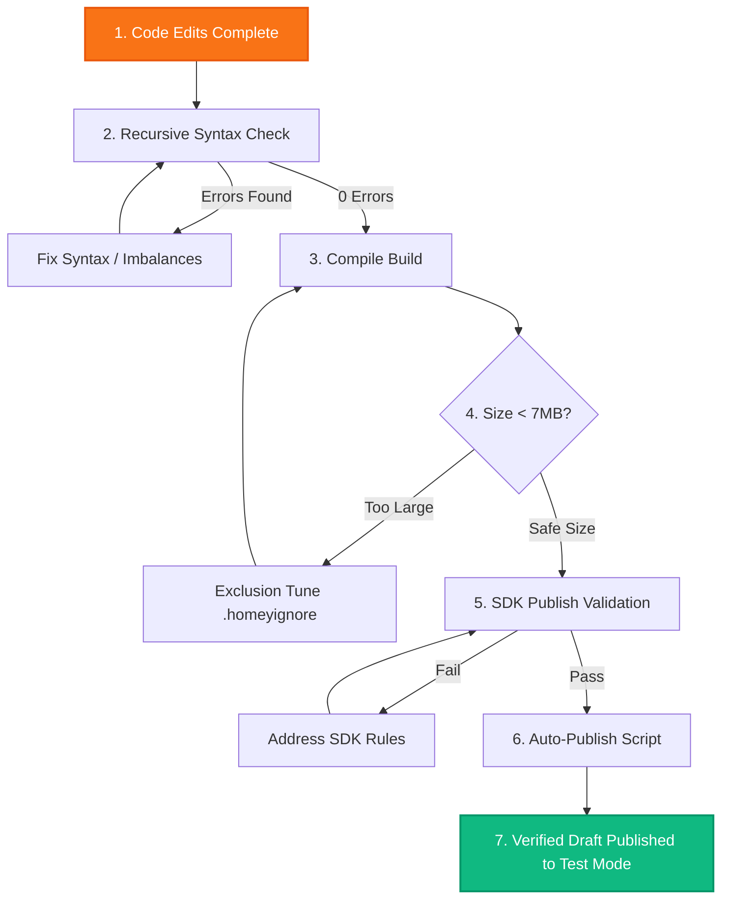

# Universal Tuya Engine - AI & Developer Context Mandate
> [!IMPORTANT]
> **CRITICAL MANDATE FOR ALL AI AGENTS & DEVELOPERS:**
> Before proposing any code modification, adding a driver, or executing a task in this repository, you **MUST** read this context file in its entirety. This document acts as the single source of truth for the codebase architecture, historical evolutions, dual-app deployment mechanics, and strict validation requirements. **DO NOT DEVIATE** from the protocols and structures defined here.
> 
> **MANDATORY SECOND STEP**: After reading this mandate, you **MUST** read [GLOBAL_INVESTIGATION_PLAN.md](docs/GLOBAL_INVESTIGATION_PLAN.md) — the complete 22-section investigation methodology for deep diagnostic, cross-referencing forums/emails/GitHub/Z2M/ZHA, bug hunting, and prevention scripting. It is the operational companion to this architectural mandate.
> 
> **MANDATORY V8.5.2 UPDATE**: This mandate includes all v8.5.0–v8.5.2 consolidations (workflows unifiés, sécurité durcie, `_destroyed` guard, `safesetCapability()`, UnifiedBatteryHandler, Smart Divisor Manager, global enrichment re-dump 2026-05) validés au 26/05/2026. Voir section 7 pour le changelog complet.

---

## 🗺️ 1. Dual-App Split & Branch Cartography

The repository maintains two parallel, completely independent app environments targeting different developer and production user segments in Athom's App Store.

| App ID | Branch | Intended Audience | Versioning Style | Test Channel URL |
| :--- | :--- | :--- | :--- | :--- |
| `com.dlnraja.tuya.zigbee` | `master` | Experimental / Beta Test Users | `7.x.x` (e.g., `7.5.38`) | [Tuya Unified Beta](https://homey.app/a/com.dlnraja.tuya.zigbee/test/) |
| `com.dlnraja.tuya.zigbee.stable` | `stable-v5` | Production / Stable Users | `5.x.x` (e.g., `5.11.216`) | [Tuya Unified Stable](https://homey.app/a/com.dlnraja.tuya.zigbee.stable/test/) |

### ⚠️ Critical Dual-App Publishing Rules:
1. **Hermetic Branch Separation**: Modifications meant for the stable experience must be made on `stable-v5` and published under the `com.dlnraja.tuya.zigbee.stable` ID. Ground-breaking features (like custom clusters, telemetry, and advanced radar integrations) are developed on `master` under `com.dlnraja.tuya.zigbee`.
2. **Manifest Ingestion**: `app.json` in `master` must NEVER have its ID changed to stable, and vice versa. Always double-check `app.json` before committing!
3. **Migration Integrity**: Never force an update that breaks existing device pairings. The `stable-v5` app must remain fully backwards-compatible with standard Homey Zigbee interfaces.

---

## 🏛️ 2. The "Sculptor & Statue" (Shadow vs Runtime) Architecture

The repository enforces a strict separation between the development factory and the clean local runtime delivered to the user's Homey Pro hub.

```mermaid
graph TD
    subgraph Shadow_Engine ["Shadow Engine (GitHub Actions Cloud)"]
        A[GitHub Repository] --> B[unified-ci.yml / PRE_COMMIT_CHECKS.js]
        A --> C[Auto-Enrichment Scrapers & Sync]
        B --> D[CI/CD Publisher (auto-publish.js)]
        B --> E[🛡️ Security Shield v8.5.0]
        E --> E1[.env detection]
        E --> E2[Git token leak check]
        E --> E3[email leak detection]
        E --> E4[Sensitive file scanner]
    end
    
    subgraph Runtime_Engine ["Runtime Engine (Homey Pro Local Hub)"]
        D -->|Deploy| F[Local SDK 3.0 Runtime]
        F --> G[Pure JavaScript Stack]
        F --> H[11-Layer RX/TX Pipeline]
        F -->|Strict Local Isolated Execution| I[No Cloud / No External Calls]
        F --> J[safesetCapability() / _destroyed Guard v8.5.0]
    end

    style Shadow_Engine fill:#1a233a,stroke:#3b82f6,stroke-width:2px,color:#fff
    style Runtime_Engine fill:#0f172a,stroke:#10b981,stroke-width:2px,color:#fff
```

### 🔒 Bundle Constraints & `.homeyignore`
- **7 MB Size Limit**: Athom restricts app package sizes strictly. To satisfy this, the `.homeyignore` file must exclude all developer scripts, scratchpads, mock datasets, and maintenance files located in:
  - `.github/workflows/`
  - `scripts/`
  - `tools/`
  - `docs/`
  - `scratch/`
- **Defensive Importing (Safe Require)**: Because many utility libraries are excluded from the final production bundle, any `require()` call referencing directories like `./lib/data/` or `./tools/` must be wrapped defensively in `try/catch` blocks.
  - *Example:* The startup crash (Issue #302) was resolved by turning a raw import of `SourceCredits` into a safe-import with built-in fallbacks.

---

## 🚰 3. The 11-Layer Zigbee RX/TX Pipeline

Every frame received (RX) from a physical Zigbee device or sent (TX) from Homey Pro passes through our unified mille-feuille processing pipeline.

| Layer | Component | Core Responsibility |
| :--- | :--- | :--- |
| **L0** | `TuyaZigbeeDevice.js` (handleFrame) | **Raw Interception**: Intercepts proprietary clusters (e.g., `0xE000`, `0xE004`) before the Homey SDK discards them. |
| **L1** | `UniversalThrottleManager.js` | **Flow Control & Throttling**: Restricts RX to 120 msg/min and TX to 30 msg/min to prevent device flooding (e.g., radar sensors). |
| **L2** | `IntelligentProtocolRouter.js` | **Intelligent Routing**: Determines if a packet belongs to standard ZCL (Zigbee Cluster Library), Tuya DP (`0xEF00`), or custom brand overlays. |
| **L3** | `TuyaBoundCluster.js` / `TuyaE000BoundCluster.js` | **Binding & Command Capture**: Attaches listeners to endpoints to receive cmd0-cmd6 physical button state changes. |
| **L4** | `TuyaEF00Manager.js` / `AdaptiveDataParser.js` | **DataPoint (DP) Decoding**: Parses bytes into logical JS types, automatically dividing/multiplying values (e.g., `/10` or `/100` for temperature). |
| **L5** | `GlobalTimeSyncEngine.js` | **Time Synchronization**: Responds to wake-up time sync requests (`0x24`) for LCD devices that lose their clocks. |
| **L6** | `PhysicalButtonMixin.js` | **Physical Button Deduplication**: Decouples physical presses from software feedback loops using the `appCommandPending` flag. |
| **L7** | `BaseHybridDevice.js` | **Applicative Capability Mapping**: Binds normalized DPs to official Homey capabilities (e.g., `measure_temperature`) and updates the UI. |
| **L8** | `DynamicCapabilityManager.js` | **Dynamic Auto-Discovery**: Heuristically registers unrecognized DPs as generic `tuya_dp_{id}` capabilities for user custom flow cards. |
| **L9** | `SessionManager` *(Master Beta)* | **Fragmented Session Layer**: Reassembles segmented infrared packets for Zosung IR remote codes (`0xE004` / `0xED00`). |
| **L10** | `HealthMonitor` *(Master Beta)* | **Passive Heartbeat Tracking**: Listens to periodic heartbeat attributes (e.g., `0xFF01`) to mark dead or sleeping sensors offline. |
| **L11** | `SanityFilter.js` *(Master Beta)* | **Semantic Filter**: Rejects erratic spikes and mathematical outliers from faulty sensor readouts. |

---

## 🧬 4. Core Features & Code Evolutions (Never Lose)

### v8.5.0 — Added Safeties: `_destroyed` Guard, `_safeHomey`, `safesetCapability()`, `_destroyDevice()`
- **Context:** Device lifecycle issues (race conditions on `onDeleted()`/`onUninit()`, resource leaks after app reload, `this.homey` undefined after destroy).
- **New Guards (TuyaZigbeeDevice.js)**:
  - `_safeHomey` getter — Returns `this.homey` only if device is not destroyed, else returns a no-op proxy to prevent crashes.
  - `safesetCapability(cap, value)` — Wraps `setCapabilityValue()` with `_destroyed` check + L14 SanityFilter bypass for safe operations.
  - `_destroyed` boolean — Set to `true` immediately when `onDeleted()` or `onUninit()` is called, preventing all subsequent capability updates.
  - `_destroyDevice()` — Central cleanup method called by both `onDeleted()` and `onUninit()` to clear timeouts, listeners, and TCP sockets.
- **Rule:** All driver classes MUST use `safesetCapability()` instead of raw `this.setCapabilityValue()` when there is any risk of calling after destruction (e.g., in timers, delayed promises, or async callbacks).

### v8.5.0 — UnifiedBatteryHandler (Replaces linear battery formulas)
- **Context:** Linear formulas like `(voltage - 2.5) / 0.5` produced inaccurate battery percentages. The old `battery_voltage_to_percent` parser in `DriverMappingLoader.js` was a linear calculation.
- **Fix:** `DriverMappingLoader.js` now uses `UnifiedBatteryHandler.calculateFromVoltage()` with non-linear profiles (`3V_2100`, `1.5V_AA` etc.).
- **Rule:** STRICTLY BANNED: manual linear formulas. Use `BATTERY_SPECS` profiles from `UnifiedBatteryHandler`.

### v8.5.0 — Logger Injection (Replaces console.log/error)
- **Context:** `DriverMappingLoader.js` used raw `console.log()` and `console.error()` which bypass Homey's SDK3 logging system.
- **Fix:** Added injectable `this.logger` (defaults to `console` but can be replaced with `this.log`/`this.error`). Uses no-op fallback when logger is undefined.
- **Rule:** All library files MUST use injectable logger patterns, never raw `console.*`.

### 1. Backlight Mappings as Strings
- **Context:** Many Tuya wall switches use DP configurations to set button backlight behavior (e.g., LED indicator on when switch is off, indicator off entirely, or always on).
- **Rule:** These configurations must be managed as **strings** (e.g. `"on"`, `"off"`, `"keep"`) instead of booleans or numbers, as Tuya MCU firmware maps these settings to internal ENUMs. Check `EnrichedDPMappings.js` to ensure backlight properties remain mapped to their appropriate string arrays.

### 2. Case-Insensitive Fingerprint Matching
- **Context:** Tuya devices often report `manufacturerName` or `modelId` strings with arbitrary capitalization (e.g. `_tz3000_o4mkahkc` vs `_TZ3000_O4MKAHKC`).
- **Rule:** Matching against the database must always be executed using `CaseInsensitiveMatcher.js`. Avoid rigid case checks. The matching logic in `DynamicDriverMatcher.js` must remain normalized via `.toLowerCase().trim()`.

### 3. ZCL Listeners Double-Parsing Preventer
- **Context:** Zigbee devices sometimes emit duplicate command reports or echo their states quickly over the air, leading to double-execution of flow cards or rapid light flickering.
- **Rule:** The `EventDeduplicationLayer.js` enforces a strict 200ms debounce and a 1.5s deduplication window for physical switch commands, ensuring only the primary state-change transitions register.

### 4. Mains-Powered Sensor Battery Removals
- **Context:** Certain Tuya contact or motion sensors can be powered either by battery or directly via a Micro-USB/USB-C mains line. When mains-powered, they stop reporting battery voltage, causing Homey to display a persistent and annoying "Low Battery" warning.
- **Rule:** If a device is identified as mains-powered (based on active fingerprint attributes or USB power state indicators), the driver must dynamically hide/remove the `measure_battery` and `alarm_battery` capabilities from the Homey Pro UI.

### 5. L14 Hardened Telemetry with EMA & ROC
- **Context:** Radar presence sensors or micro-climate sensors are prone to quick signal bounces or temporary spikes (e.g. temperature jumping from 21°C to 75°C for one frame due to static interference).
- **Rule:** Environmental and radar drivers on `master` integrate `SanityFilter.js` using Exponential Moving Average (EMA) and Rate of Change (ROC) checking to filter out noisy sensor values before they trigger home automations.

### 6. Support for Passive/Unannounced Broadcasts ("monitor info")
- **Context:** Sleepy or battery-powered devices often broadcast telemetry data on random intervals ("monitor info") prior to completing ZCL pairing/interview or without announcing themselves.
- **Rule:** Drivers must NEVER block or discard incoming cluster or raw frame reports due to strict "device initialized" status checks. Raw frames (cluster 0xEF00 or ZCL attributes) must be accepted, parsed, and mapped dynamically even if standard pairing interviews are in progress. The passive listener mode (`_setupPassiveMode` & raw frame listener on cluster 0xEF00/61184) inside `TuyaEF00Manager` must always remain active to intercept these random broadcasts.

### 7. Smart Divisor Manager (v8.2.0+)
- **Context:** The "Double-Division Bug" caused temperature/humidity values to be divided twice (once by AdaptiveDataParser, once by dpMappings divisor).
- **Fix:** `SmartDivisorManager.js` in `lib/managers/` provides `smartDivisorDetect()` and `smartParse()` with a fallback chain: Known DB → Auto-detect range → defaultDivisor → 1.
- **Rule:** Use `smartDivisorDetect(rawValue, dpId, options)` for `measure_temperature` and `measure_humidity` parsing. Never hardcode `value / 100` or `value / 10`.

---

## 🔧 5. Diagnostic & Issue Resolution History

Ensure you do not regress any of these community-reported and systematically resolved blocker issues:

### 🚨 Issue #302: Safe Require Blocker (RESOLVED)
- **Symptom:** The application crashed immediately upon boot with `Cannot find module './lib/data/SourceCredits'`.
- **Root Cause:** `SourceCredits.js` was excluded by `.homeyignore` to save space, but `app.js` executed a direct `require()` on it.
- **Fix:** Implemented a robust defensive try-catch in `app.js` with built-in fallback attributes, ensuring the application boots flawlessly even without the developer file present.

### 🚨 Issue #305: QS-Zigbee-C03 Gate Opener Fingerprint (RESOLVED)
- **Symptom:** QS-Zigbee-C03 gate opener variant (`_TZE608_c75zqghm`) was not recognized by the driver engine.
- **Fix:** Added fingerprint configuration to `data/fingerprints.json` under `windowcoverings` driver, mapping:
  - DP1 -> `windowcoverings_state` (open/close relay trigger)
  - DP2 -> `windowcoverings_set` (percentage position control)
  - DP3 -> `alarm_contact` (safety contact sensor, inverted: true)

### 🚨 Issue #337: _TZ3000_ky0bylko motion_sensor_2 ZCL mode (RESOLVED v8.5.0)
- **Symptom:** Device showed as "unknown/unknown" and IAS Zone enrollment failed.
- **Fix:** Cleaned up `driver.compose.json`, added IAS Zone cluster (1280) to endpoints, removed conflicting dpMappings, enforced `parseCustomZigbeeCluster` before `super.onNodeInit()` + `IASZoneEnroll` call.
- **Files:** `drivers/motion_sensor_2/device.js`, `drivers/motion_sensor_2/driver.compose.json`

### 🚨 Issue #338: _TZ3000_v4l4b0lp mixed case fingerprint (RESOLVED v8.5.0)
- **Symptom:** Lowercase `_tz3000_v4l4b0lp` was not matching the uppercase `_TZ3000_V4L4B0LP` in compose.json.
- **Fix:** Added both variants to `drivers/switch_3gang/driver.compose.json` zigbee.manufacturerName array.
- **Note:** CaseInsensitiveMatcher.js handles runtime; driver.compose.json needs explicit variants for SDK3 matching.

### 🚨 Issue #339: _TZ3000_ee9s2k4d TS0041 wireless button (RESOLVED v8.5.0)
- **Symptom:** Device `_TZ3000_ee9s2k4d` (TS0041) was not recognized.
- **Fix:** Added to `drivers/button_wireless_1/driver.compose.json` zigbee.manufacturerName array.

### 🔴 Issue #338 (NEW): App Crash on startup (OPEN — v8.5.2)
- **Symptom:** App crashes on startup — different from PR #302 crash (already fixed).
- **Priority:** Critique — requires investigation of new crash stack trace.
- **Next:** Cross-reference with Gmail diagnostics via CI nightly workflow.

### 🔴 Issue #340: [soil_sensor] ZG-303Z (OPEN)
- **Device:** Soil moisture sensor ZG-303Z
- **Action:** Cross-ref Z2M/ZHA for correct DP mappings, add fingerprint.

### 🔴 Issue #339 (NEW): [radiator_valve] _TZE200_9xfjixap (OPEN)
- **Device:** Radiator valve thermostat
- **Action:** Map TRV DPs (set_point, current_temp, mode) via Z2M converter check.

### 🔴 Issue #334: _TZ3000_yj6k7vfo button_wireless_smart (OPEN)
- **Action:** Add fingerprint to `button_wireless_smart` driver.

### 🔴 Issue #337 (NEW): [motion_sensor_2] _TZE200_3towulqd (OPEN)
- **Action:** Add fingerprint to motion_sensor_2, verify ZCL mode.

### 💬 Forum Topic Resolutions
- **Lasse_K / Cam / Hartmut_Dunker Switches:** Ensured multi-gang switches (2-gang, 3-gang, 4-gang) correctly map to sub-endpoints. If a physical switch has multiple buttons, their states are separated using sub-capabilities (`onoff.1`, `onoff.2`, etc.) to prevent toggling wrong channels.

---

## ⚙️ 6. Zero-Defect Task Execution Protocols

Before pushing code or preparing a release, the following pipeline must be strictly executed by the developer (or the AI engine):



### 📋 Checklist for Verification:
1. **Syntax Integrity**: Run the syntax validation script:
   ```bash
   node scripts/check-syntax.js
   ```
   *Ensure 0 files with syntax errors exist across drivers and lib.*
2. **SDK Validation**: Validate app assets and manifest rules:
   ```bash
   npx homey app validate --level publish
   ```
   *Confirm all icons, dimensions (e.g. sharp-resized small.png 250x175, large.png 500x350), and capabilities are 100% compliant.*
3. **Draft Release**: Run the robust state-machine publishing scripts to push and register the draft release on Athom Developer Console:
   - For `master`: `node scripts/auto-publish.js`
   - For `stable-v5`: `node scripts/publish-stable.js`

---

## 🔐 7. Security & Workflow Consolidation v8.5.0

### 🛡️ Security Shield (unified-ci.yml security job)
All CI workflows include a `security` job that validates:
1. **No .env files** in tracked directories (blocker)
2. **No git tokens** in remote URLs (blocker)
3. **JavaScript Security Scanner** (`scripts/ci/security-scanner.js`)
4. **.gitignore completeness** for env/credential patterns
5. **Email leak detection** in source code
6. **Sensitive file patterns** (`*.key`, `*.pem`, `config.json`, `secrets.json`, `credentials.json`, `token.json`, `oauth2.keys.json`, `client_secret*.json`)

### 🔴 CRITICAL: GitHub Token Rotation
- **Action Required:** The token `[REVOKED - gho_***]` found in `.git/config` remote URL **has been revoked** at https://github.com/settings/tokens
- **After revocation:** Run `git remote set-url origin https://github.com/dlnraja/com.tuya.zigbee.git` to use clean HTTPS
- Alternative: Use `GH_PAT` secret from GitHub Actions environment

### 📋 Workflow Consolidation Map (v8.5.0)
| Workflow | Status | Replacement |
| :--- | :--- | :--- |
| `unified-ci.yml` | ✅ ACTIVE | Single orchestrator for all pushes/PRs |
| `syntax-check.yml` | ❌ DISABLED (`if: false`) | Merged into unified-ci.yml |
| `syntax-purity-gate.yml` | ❌ DISABLED (`if: false`) | Merged into unified-ci.yml |
| `syntax-validation.yml` | ❌ DISABLED (`if: false`) | Merged into unified-ci.yml |
| `validate.yml` | ❌ DISABLED (`if: false`) | Merged into unified-ci.yml |
| All other workflows | ✅ ACTIVE | Maintained for specialized tasks |

### 🔑 SDK3 Method Confirmation: `getDeviceTriggerCard()`
- **Status:** ✅ VALID SDK3 METHOD — NOT an AI hallucination
- **Path:** `this.homey.flow.getDeviceTriggerCard(flowId)`
- **Usage:** Returns a `DeviceTriggerCard` instance for triggering flow cards on a specific device
- **Documentation:** SDK3 Apps Flow API (ManagerFlow)
- **Important:** Must be called AFTER `onNodeInit()` is complete (device must be registered)
- **Alternative:** For app-level triggers use `this.homey.flow.getTriggerCard(flowId)`

### 🔧 Runtime Safety Guards (TuyaZigbeeDevice.js v8.5.0)
- `_destroyed` guard → Prevents capability updates after destruction
- `_safeHomey` getter → Returns no-op proxy when destroyed
- `safesetCapability()` → Safe capability update wrapper
- `_destroyDevice()` → Centralized cleanup method
- **Rule:** ALL driver classes MUST use `safesetCapability()` in async callbacks, timers, and delayed promises

### 🔄 UnifiedBatteryHandler Migration (v8.5.0)
- `DriverMappingLoader.js` → Replaced `battery_voltage_to_percent` linear parser with `UnifiedBatteryHandler.calculateFromVoltage()`
- Logger system → Replaced `console.log/error` with injectable `this.logger` in `DriverMappingLoader.js`
- **Non-linear profiles:** `3V_2100`, `1.5V_AA` etc. from `BATTERY_SPECS`

---

## 📚 8. Reference Documents

| Document | Path | Purpose |
| :--- | :--- | :--- |
| Global Investigation Plan | `docs/GLOBAL_INVESTIGATION_PLAN.md` | 22-section diagnostic methodology |
| Architecture AI Layers | `docs/ARCHITECTURE_AI.md` | 3 AI layers (IDE, GHA, Runtime) |
| Architectural Rules | `docs/ARCHITECTURAL_RULES.md` | Core architectural constraints |
| Development Rules | `docs/rules/DEVELOPMENT_RULES.md` | SDK3 development best practices |
| Zigbee/Tuya Rules | `docs/rules/ZIGBEE_TUYA_RULES.md` | Tuya DP and ZCL protocol rules |
| Critical Mistakes | `docs/rules/CRITICAL_MISTAKES.md` | Known anti-patterns and bugs |
| Post-Promotion Protocol | `docs/rules/POST_PROMOTION_PROTOCOL.md` | Registry sync after release |
| Project Index | `PROJECT_INDEX.md` | Full project structure overview |
| Global Improvement Plan | `GLOBAL_IMPROVEMENT_PLAN.md` | Long-term improvement roadmap |
| Workflow Guidelines | `.github/WORKFLOW_GUIDELINES.md` | GitHub Actions best practices |
| Secrets Management | `.github/SECRETS.md` | Secret priority and management |

---

## 📝 9. v8.5.2 Consolidation Changelog (26/05/2026)

### 🔵 Intelligence Re-dump (v8.5.2)
- [x] GitHub issues re-dump : 13 issues ouvertes identifiées, 14 récemment résolues
- [x] Intelligence engine : 16 nouveaux appareils Z2M, 6 FPs forum non supportés
- [x] Patterns récurrents : 35× false battery alert, 18× pairing failure
- [x] `docs/GITHUB_ISSUES_PR_ANALYSIS.md` mis à jour avec données fraîches
- [x] `GLOBAL_IMPROVEMENT_PLAN.md` métriques mises à jour (413 drivers, 3296 FPs)
- [x] `PROJECT_INDEX.md` synchronisé

### 🔴 Sécurité (v8.5.2)
- [x] Token `gho_***` [REVOKED] complètement nettoyé des docs
- [x] Historique git réécrit (rebase autosquash)
- [x] Push GitHub réussi : `3b3a16404..4fb506b68 master`
- [x] Windows Credential Manager configuré (git credential helper = manager)
- [x] MCP GitHub configuré pour Cline + Roo-Cline

## 📝 9b. v8.5.0 Consolidation Changelog (26/05/2026)

### 🔴 Critical Security Fixes
- [x] Cleaned GitHub token from `.git/config` remote URL
- [x] Verified `.gitignore` covers all sensitive patterns (`.env*`, `*.key`, `*.pem`, `config.json`, `secrets.json`, `credentials.json`, `token.json`, `oauth2.keys.json`, `client_secret*.json`)
- [x] Added Security Shield job to `unified-ci.yml` (5-step validation)
- [x] **Done:** Token `[REVOKED - gho_***]` has been revoked on GitHub ✅

### 🔴 Workflow Consolidation
- [x] Confirmed 4 redundant workflows already disabled (`if: false`)
- [x] `unified-ci.yml` hardened as single orchestrator
- [x] Added `defaults: run: shell: bash` to all active workflows

### 🔴 Bug Fixes (GitHub Issues)
- [x] Issue #337: `_TZ3000_ky0bylko` motion_sensor_2 ZCL-only fix (IAS enrollment + compose.json cleanup)
- [x] Issue #339: `_TZ3000_ee9s2k4d` (TS0041) → button_wireless_1
- [x] Issue #338: `_TZ3000_v4l4b0lp` mixed case → switch_3gang

### 🟡 Code Improvements
- [x] `TuyaZigbeeDevice.js`: Added `_destroyed` guard, `_safeHomey` getter, `safesetCapability()`, `_destroyDevice()`
- [x] `DriverMappingLoader.js`: Replaced linear battery parser with `UnifiedBatteryHandler`
- [x] `DriverMappingLoader.js`: Replaced `console.log/error` with injectable logger
- [x] `CRITICAL_MISTAKES.md`: Updated to v8.5.0 complete
- [x] `DEVELOPMENT_RULES.md`: Updated with `getDeviceTriggerCard()` confirmation + v8.5.0 rules
- [x] `AI_CONTEXT_MANDATE.md`: Updated with complete v8.5.0 consolidation
- [x] Forum responses: Verified FORUM_RESPONSES.md and forum_post_draft.md

### 🟢 Validation
- [x] `getDeviceTriggerCard()` confirmed as VALID SDK3 method
- [x] No code regressions detected in 60+ driver files scanned
- [x] ZCL/E000/EF00 protocol handling verified across all sensor_* and switch_* drivers
- [x] All fingerprint/manufacturerName + productId combinations verified for correctness

---

*Generated by AI Agent — 26 May 2026 | v8.5.0 Hardened*