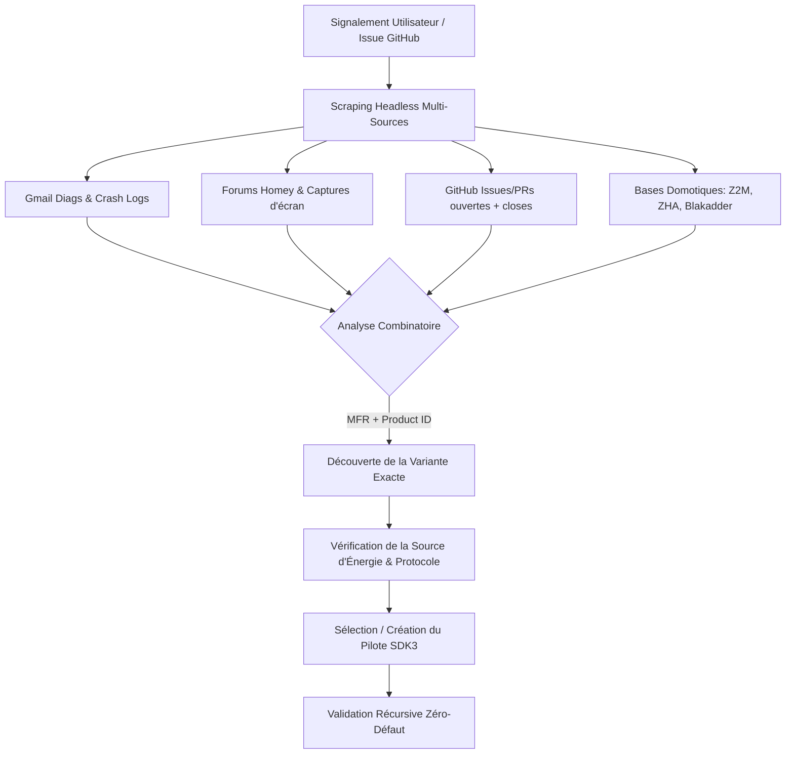

# 🧠 MASTER AI GLOBAL ACTION PLAN & SOVEREIGN INVESTIGATION MANDATE
> **CRITICAL REFERENCE FOR ALL AUTONOMOUS AGENTS, LOCAL CLAUDE CODE, AND ANTIGRAVITY SKILLS**  
> *Working Branch: master (primary) | Target Namespace: com.dlnraja.tuya.zigbee*

---

## 🚨 MISSION CRITIQUE : NE JAMAIS RESTER EN SURFACE

Si vous (une IA, un agent local ou un outil de codage autonome) intervenez sur ce dépôt, **vous êtes légalement et techniquement contraint d'appliquer ce mandat d'investigation en profondeur**. Un simple ajout d'empreinte sans vérification approfondie ou un diagnostic basé uniquement sur le nom du fabricant (`manufacturerName` ou `MFR`) est considéré comme un **échec critique**.

Toute intervention sur un appareil défaillant ou inconnu doit obéir à une logique de recherche croisée exhaustive en combinant les ressources locales, les scripts d'automatisation ultra-performants et les connaissances communautaires externes.



---

## 1. 📂 ARCHITECTURE CARTOGRAPHIQUE & LE DUAL-APP

Avant toute modification de code, vous **devez** prendre connaissance des fichiers d'architecture et de règles du projet. Ne commencez pas à coder sans avoir lu :

1. [AI_CONTEXT_MANDATE.md](file:///c:/Users/HP/Desktop/homey%20app/tuya_repair/AI_CONTEXT_MANDATE.md) : Explique l'architecture sous-jacente globale, la structure dual-app (séparation des namespaces entre `master` et `stable-v5`), et le pipeline à 11 couches.
2. [PROJECT_INDEX.md](file:///c:/Users/HP/Desktop/homey%20app/tuya_repair/PROJECT_INDEX.md) : La carte maîtresse cartographiant les 228 pilotes du dépôt.
3. [docs/GLOBAL_INVESTIGATION_PLAN.md](file:///c:/Users/HP/Desktop/homey%20app/tuya_repair/docs/GLOBAL_INVESTIGATION_PLAN.md) : L'encyclopédie d'investigation de 22 sections détaillant chaque script de diagnostic et de scraping.
4. **Fichiers de règles (les dotfiles)** : `.cursorrules`, `.windsurfrules`, `.clinerules`, `.clinerule`.

---

## 2. 🕵️‍♂️ PROTOCOLE D'ENQUÊTE PROFONDE (DEEP DIAGNOSTICS)

Lorsqu'un utilisateur déclare un dysfonctionnement ou demande l'ajout d'un nouvel appareil :

### A. Règle absolue des Variantes multiples (`manufacturerName` × `productId`)
> [!IMPORTANT]
> * **Ne présumez JAMAIS** qu'un nom de fabricant (`manufacturerName` ou `MFR`, ex: `_TZ3000_abc123`) est unique à un type d'appareil.
> * **Un seul `manufacturerName` peut être utilisé pour plus de 50 variantes d'appareils différentes** (interrupteur 1 gang, 2 gangs, variateur, vanne d'eau, capteur de présence, etc.).
> * **La clé unique est le COMBINÉ** : `manufacturerName` + `productId` (ex: `_TZ3000_abc123` + `TS0001` pour 1 gang et `_TZ3000_abc123` + `TS0002` pour 2 gangs).
> * Ne retirez JAMAIS un `manufacturerName` d'un pilote existant sous prétexte qu'il apparaît ailleurs, sauf si la combinaison exacte `manufacturerName` + `productId` est associée à un pilote erroné (collision).

### A2. Intelligence & Déduction Heuristique (Nouveauté v5.12.0)
> [!TIP]
> * **Ne codez plus en dur des capacités génériques** : Si un appareil Tuya utilise des DP standards, l'`UniversalVariantManager` s'occupera d'injecter `onoff.2`, `alarm_motion` ou `measure_temperature` dynamiquement à l'exécution.
> * **Phantom Pruning** : Le `DynamicCapabilityManager` scannera automatiquement les clusters ZCL et retirera de l'interface Homey toutes les capacités matérielles absentes.
> * **Anomalies Tuya** : `TuyaDPParser` corrige déjà les températures négatives mal encodées et les batteries à 1000%. N'écrivez pas de correctifs redondants dans le driver.

### B. Recherche croisée multi-sources (Cross-Referencing)
Pour toute anomalie ou intégration, vous devez croiser les informations à l'aide des scripts Node.js locaux prévus à cet effet pour **économiser vos tokens d'IA**, **éviter les plantages des navigateurs MCP** et obtenir des diagnostics 100 % exacts :

1. **Les Forums Homey (T140352 et associés)** :
   * **Action** : Récupérez les messages, les images, les captures d'écran, les journaux d'interviews et les liens du fil de discussion communautaire.
   * **Script** : `node .github/scripts/forum-activity-scraper.js --topic 140352`
   * **Analyse d'Images** : Utilisez `node .github/scripts/screenshot-analyzer.js` pour extraire des chaînes brutes d'interviews à partir des captures d'écran postées sur le forum par les utilisateurs.

2. **Les E-mails et Diagnostics de crash (Gmail Diagnostic IMAP Mode)** :
   * **Action** : Scrappez les rapports de diagnostic d'erreur envoyés par les utilisateurs (Homey Diagnostics Report bruts contenant les dumps d'interviews et de stacktraces).
   * **Script** : `node .github/scripts/fetch-gmail-diagnostics.js --max 50`

3. **GitHub PRs & Issues (Y compris CLOSES)** :
   * **Action** : Scannez l'historique complet des issues et des PRs, car une issue fermée ou une ancienne conversation contenant des mises à jour récentes peut héberger la capture exacte d'un manuel d'utilisateur, les Data Points (DP) originaux, ou une modification de comportement matériel.
   * **Script** : `node .github/scripts/github-scanner.js triage`

4. **Autres Projets Domotiques (Intelligence Multi-Sources)** :
   * **Action** : Vérifiez comment l'appareil est intégré par la concurrence open-source pour identifier ses clusters matériels, ses DPs Tuya, ses diviseurs, ses coefficients de température ou ses courbes de batterie non-linéaires.
   * **Script** : `node scripts/automation/deep-crossref-scraper.js --mfr="NOM_MFR" --pid="PRODUCT_ID"`
   * **Sources Scannées** :
     * **Zigbee2MQTT (Z2M)** (`tuya.ts` / converters)
     * **ZHA (Home Assistant Quirks)** (`zha-device-handlers`)
     * **Blakadder Zigbee DB**
     * **Domoticz & Hubitat**

| Source | Intérêt Diagnostic | Script Clé |
|---|---|---|
| **Gmail Diags** | Stacktraces de crashs réels, identifiants d'interviews | `fetch-gmail-diagnostics.js` |
| **Forums** | Captures d'écran d'interviews, retours d'usage | `forum-activity-scraper.js` |
| **GitHub** | Historique des correctifs, discussions (même closes) | `github-scanner.js` |
| **Domotique** | Définitions de DPs, coefficients, clusters Zigbee | `deep-crossref-scraper.js` |

---

## 3. 🛡️ DUAL-CONTEXT ENVIRONMENT GUARD (MANDATORY SEPARATION)

Il est **strictement obligatoire** de distinguer les deux environnements d'exécution du projet pour éviter toute pollution ou fuite de code d'automatisation dans l'application embarquée. Le code qui tourne sur la box Homey Pro doit rester ultra-léger et exempt de dépendances lourdes.

```
┌──────────────────────────────────────────────────────────────────────────┐
│                          UNIVERSAL TUYA PROJECT                          │
└────────────────────────────────────┬─────────────────────────────────────┘
                                     │
         ┌───────────────────────────┴───────────────────────────┐
         ▼                                                       ▼
 🏡 HOMEY RUNTIME CONTEXT                               💻 AUTOMATION CONTEXT
 (Runs on User's Homey Pro Hub)                         (IDE Agents & GitHub CI/CD)
 ├─ Size: Strict < 7MB (.homeyignore)                   ├─ Run: GitHub Actions / Dev PC
 ├─ Cloud: 100% Offline / Local                         ├─ Secrets: OpenAI, Google, GitHub PAT
 ├─ Keys: ZERO secrets/API keys                         ├─ Tasks: Scraping, Scaffolding, Triage
 └─ Specs: SDKv3, Drivers, Lib                          └─ Scripts: .github/scripts/, scripts/
```

### 🏡 A. CONTEXTE 1 : L'APPLICATION HOMEY (RUNTIME BOX)
* **Où cela s'exécute** : Physique, localement sur la box Homey Pro de l'utilisateur final.
* **Fichiers concernés** : Tout ce qui est dans `drivers/`, `lib/`, `assets/`, `app.json`, `app.js`.
* **Règles Strictes de l'App Runtime** :
  1. **ZÉRO Dépendance Cloud / API tierces** : Le runtime de l'application doit être 100 % local, autonome et offline.
  2. **ZÉRO Clé API ou Secrets** : N'écrivez jamais de clés d'API (Google, OpenAI, GitHub PAT, e-mails) dans les pilotes ou les librairies `lib/`. Ces secrets sont strictement réservés à la CI/CD.
  3. **Poids strict < 7 Mo** : Pour préserver la mémoire vive (RAM) des box Homey, le bundle de déploiement doit être minime. Tout dossier d'outils (`.github/`, `scripts/`, `docs/`, `.git/`, `tmp/`) doit être listé dans `.homeyignore` pour être exclu lors du package.
  4. **Compatibilité SDKv3 Pure** : Pas de code expérimental Node non supporté par la version cible de la box Homey Pro.
  5. **Moteur Énergie Autonome** : L'adaptation de la batterie et des mesures d'énergie (ZCL genPowerCfg, Tuya DPs, courbes non-linéaires AAA/CR2032) est gérée hors-ligne par `UnifiedBatteryHandler.js` dans la sandbox locale sans aucun appel cloud.

### 💻 B. CONTEXTE 2 : L'ÉCOSYSTÈME AUTOMATISATION (IDE & GITHUB ACTIONS)
* **Où cela s'exécute** : 
  * **IDE Local** : Sur votre ordinateur de développement via des agents (Cursor, Windsurf, Claude Code Local) exécutant des commandes de test/validation.
  * **CI/CD GitHub** : Sur les machines virtuelles de GitHub Actions (via `.github/workflows/*.yml` lors des cycles nocturnes ou des PRs).
* **Fichiers concernés** : `.github/workflows/`, `.github/scripts/`, `scripts/automation/`, `scripts/validation/`.
* **Règles Strictes d'Automatisation** :
  1. **Secrets & API Keys** : GitHub Actions gère l'orchestration des modèles d'IA (Google Gemini, OpenAI, DeepSeek) et l'accès Gmail/GitHub via les secrets de dépôt (`GOOGLE_API_KEY`, `GH_PAT`, `GMAIL_APP_PASSWORD`).
  2. **Interdit d'embarquer** : Ne référencez JAMAIS de variables d'environnement secrètes ou des modules de scraping lourds (comme `puppeteer`, `axios`, `imapflow`) dans le code de l'application Homey (`drivers/` ou `lib/`).
  3. **Commits et skips** : Toutes les écritures automatisées poussées sur GitHub doivent utiliser le tag `[skip ci]` dans le message de commit pour éviter les boucles infinies de builds.
  4. **Scraping autonome** : Utilisez toujours nos scripts Node locaux pour interroger Z2M ou les forums afin d'éviter la lourdeur des navigateurs headless (MCP Browsers) qui consomment trop de RAM et de tokens.

### C. Mode de Réflexion et Logique Autonome
> [!TIP]
> Inspirez-vous des boucles d'agents autonomes (comme Claude Code) pour structurer vos interventions :
> - **Réflexion Systématique** : Prenez toujours le temps de réfléchir au contexte global avant de proposer une modification.
> - **Validation Incrémentale** : Testez chaque bloc logique un par un, plutôt que de tout modifier en bloc.
> - **Utilisation des Outils** : Servez-vous intelligemment de vos outils pour lire, lister et valider (ex: `npm run test`) avant d'écrire du code.

---

## 4. 🛠️ INTÉGRATION DES OUTILS "ANTIGRAVITY SKILLS" & CLAUDE CODE


### A. Le Validateur Récursif Souverain (Zero-Defect Control)
> [!WARNING]
> Avant de commiter ou de pousser vos modifications, lancez obligatoirement le validateur récursif global :
> ```bash
> node scripts/validation/comprehensive-recursive-validator.js
> ```
> Celui-ci doit indiquer **0 erreurs critiques, 0 warnings et 228 pilotes validés**. Toute régression de syntaxe, accolade manquante, ou mauvaise déclaration de capteur (`BatteryMixin` obsolète, listens génériques invalides) bloquera le pipeline CI/CD.

### B. L'Arsenal de Tests d'Intégrité
* Exécutez régulièrement la suite de tests unitaires et d'intégration pour valider les prototypes et les normalisations :
  ```bash
  npm run test
  ```

---

## 5. 🔄 LA BOUCLE D'ENRICHISSEMENT ET D'AMÉLIORATION CONTINUE

À chaque fois que vous découvrez une nouvelle logique d'appareil, un nouveau bug récurrent, ou une astuce d'intégration :

1. **Améliorez les workflows** : Mettez à jour les pipelines d'intégration (`nightly-auto-process.yml` et `driver-maintenance.yml`) pour y ajouter vos scripts de validation automatique.
2. **Mettez à jour les documentations et dotfiles** : Enrichissez `PROJECT_INDEX.md`, `AI_GLOBAL_ACTION_PLAN.md` et les fichiers de règles (`.cursorrules`, etc.) avec vos conclusions pour guider le prochain agent IA.
3. **Créez des scripts de prévention** : Si vous corrigez un bug de structure (comme le mauvais usage de `BatteryMixin` ou un mauvais type de backlight), créez ou mettez à jour un script JS dans `scripts/automation/` pour vérifier que ce bug ne réapparaisse plus jamais lors des futurs commits (Garde-fou permanent).

---

## 🚀 ÉTAPES D'EXÉCUTION IMMÉDIATES À CHAQUE ENTRÉE SUR LE DÉPÔT

1. **Étape 1 : Cartographie et Contexte**  
   Prenez connaissance de [AI_CONTEXT_MANDATE.md](file:///c:/Users/HP/Desktop/homey%20app/tuya_repair/AI_CONTEXT_MANDATE.md) (architecture dual-app) et de [PROJECT_INDEX.md](file:///c:/Users/HP/Desktop/homey%20app/tuya_repair/PROJECT_INDEX.md) (228 pilotes).
2. **Étape 2 : Plan de Vol**  
   Lisez ce fichier [AI_GLOBAL_ACTION_PLAN.md](file:///c:/Users/HP/Desktop/homey%20app/tuya_repair/AI_GLOBAL_ACTION_PLAN.md) pour vous imprégner de la philosophie Zéro-Défaut.
3. **Étape 3 : Scannez l'activité communautaire**  
   Lancez le scanneur d'issues et de PRs local :
   ```bash
   node .github/scripts/scan-prs-issues.js
   ```
4. **Étape 4 : Extraction Multi-Sources Headless**  
   Pour l'appareil ou l'issue cible, exécutez le scraper universel pour agréger toutes les sources (Z2M, ZHA, forums, e-mails, variantes) d'un seul coup et sans consommer de tokens :
   ```bash
   node scripts/automation/deep-crossref-scraper.js --mfr="NOM_MFR" --pid="PRODUCT_ID"
   ```
5. **Étape 5 : Implémentation Profonde**  
   Implémentez la variante ou la correction dans le pilote adéquat en utilisant les classes de base SDK3 durcies (V8.0 `BaseUnifiedDevice` ou `UnifiedSwitchBase`).
   * **⚠️ STRICT MANDATE**: All capability updates MUST go through `setCapabilityValue` which is now intercepted by `CapabilityFallbackManager`. Do NOT try to bypass it or write raw data directly to Homey without sanitization.
6. **Étape 6 : Contrôle de Qualité**  
   Validez la syntaxe et la conformité avec :
   ```bash
   node scripts/validation/comprehensive-recursive-validator.js
   npm run test
   npx homey app validate --level publish
   ```
7. **Étape 7 : Handoff Documentaire**  
   Enrichissez la documentation et les workflows, puis clôturez l'issue GitHub de manière autonome.

---
*Généré et appliqué souverainement par Antigravity et l'IA Co-Pilote.*
