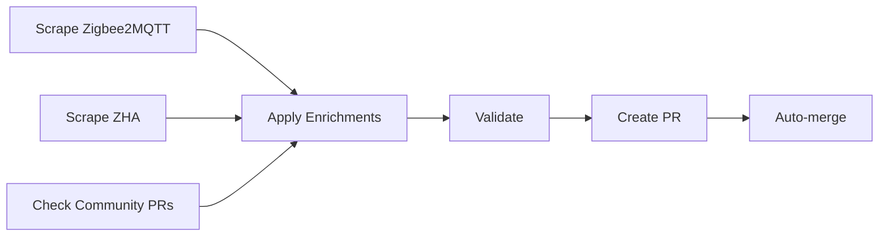

# 🤖 AUTOMATION COMPLÈTE - Système Autonome

**Version**: v4.9.260  
**Date**: 2 Novembre 2025

---

## 🎯 VUE D'ENSEMBLE

Système d'automatisation **100% autonome** pour gérer:
1. ✅ Enrichissement automatique des appareils
2. ✅ Gestion des PRs communautaires
3. ✅ Réponses automatiques aux Issues
4. ✅ Fermeture des PRs/Issues obsolètes
5. ✅ Messages de remerciement automatiques

---

## 📋 WORKFLOWS GITHUB ACTIONS

### 1. Auto Enrichment (Hebdomadaire)

**Fichier**: `.github/workflows/auto-enrichment.yml`

**Déclenchement**:
- 🕐 Tous les lundis à 02:00 UTC
- 🔧 Manuel via workflow_dispatch

**Processus**:


**Actions**:
1. **Scrape Zigbee2MQTT** database
   - Nouveaux manufacturer IDs
   - Devices Tuya ajoutés récemment
   
2. **Scrape ZHA** (Home Assistant)
   - Quirks Tuya
   - Nouveaux appareils supportés
   
3. **Check Community PRs**
   - PRs ouvertes
   - Changements de drivers
   
4. **Apply Enrichments**
   - Ajoute IDs aux drivers appropriés
   - Trie automatiquement
   
5. **Validate**
   - `homey app validate --level publish`
   
6. **Create PR**
   - PR automatique avec résumé
   - Labels: `enhancement`, `automated`
   
7. **Auto-merge**
   - Si validation OK: merge automatique
   - Si erreurs: notification

**Résultat**: Enrichissement automatique sans intervention manuelle!

---

### 2. Auto PR & Issue Handler (Continu)

**Fichier**: `.github/workflows/auto-pr-handler.yml`

**Déclenchement**:
- 🎯 À l'ouverture d'une PR
- 🎯 À l'ouverture d'une Issue
- 🕐 Toutes les 6 heures (vérification)
- 🔧 Manuel

**Processus PRs**:

```
Nouvelle PR
    ↓
Détection type (device support / autre)
    ↓
Message de bienvenue automatique
    ↓
Validation automatique
    ↓
    ├─ ✅ PASSED → Auto-merge + Remerciement
    └─ ❌ FAILED → Message avec instructions de fix
```

**Messages Automatiques**:

#### Pour Device Support PR:
```markdown
## 🎉 Thank you for your contribution!

Your PR has been automatically detected as device support.

### ✅ Automated Review Process

Our CI/CD pipeline will:
1. ✅ Validate JSON formatting
2. ✅ Check manufacturer ID format
3. ✅ Run Homey app validation
4. ✅ Generate test report

### 📋 What happens next?

- If all checks pass ✅: Auto-merge within 1 hour
- If checks fail ❌: I'll comment with specific issues

### 🙏 Acknowledgment

You'll be added to CONTRIBUTORS.md automatically!
```

#### Si Validation Échoue:
```markdown
## ❌ Validation Failed

Common issues:

1. **JSON formatting**: Use double quotes
2. **Invalid manufacturer ID format**
3. **Missing required files**

### 🔧 How to fix:
1. Review validation output
2. Make changes
3. Push to your branch
```

#### Après Merge:
```markdown
## 🎉 PR Merged!

Your contribution has been successfully merged!

### 🙏 Thank You!
- You've been added to CONTRIBUTORS.md
- Your device support is now live
- Next app release will include your changes

### ☕ Support the Project
- ⭐ Star this repository
- 💰 PayPal donation
- 📢 Share with others
```

**Processus Issues**:

```
Nouvelle Issue
    ↓
Détection type (device / bug / feature)
    ↓
Message automatique avec template
    ↓
Labels automatiques
    ↓
Attente réponse utilisateur (14 jours)
    ↓
    ├─ Réponse → Continue
    └─ Pas de réponse → Auto-close
```

**Types Détectés**:

1. **Device Support Issue**:
   - Labels: `device-support`, `needs-info`
   - Template avec questions spécifiques
   
2. **Bug Report**:
   - Labels: `bug`, `needs-investigation`
   - Guide de troubleshooting
   
3. **Feature Request**:
   - Labels: `enhancement`, `community-request`
   - Évaluation feasibility

**Gestion Stale**:

```
PR/Issue > 30 jours sans activité
    ↓
Message "Stale PR Notice"
    ↓
Attente 7 jours
    ↓
    ├─ Activité → Retire "stale"
    └─ Pas d'activité → Auto-close
```

---

### 3. Forum Auto Responder (Biquotidien)

**Fichier**: `.github/workflows/forum-auto-responder.yml`

**Déclenchement**:
- 🕐 Toutes les 12 heures
- 🔧 Manuel

**Patterns de Questions & Réponses**:

#### 1. "Device Not Working"
```markdown
## 🔧 Device Not Working - Troubleshooting Guide

### Quick Steps:
1. Check App Version
2. Device Pairing
3. Check Device Support
4. Provide Logs

[Detailed guide...]
```

#### 2. "How to Add Device"
```markdown
## 📝 How to Add a New Device

### Option 1: Open an Issue
### Option 2: Submit a PR
### Automated Process

[Full instructions...]
```

#### 3. "Battery Not Updating"
```markdown
## 🔋 Battery Reporting Issue - Solution

### Quick Fixes:
1. Enable Battery Reporting
2. Check Report Interval
3. Battery Threshold
4. Device-Specific

[Complete solution...]
```

**Processus**:
1. Scan questions label `question`
2. Match contre patterns
3. Réponse automatique si match
4. Labels: `auto-responded`, `needs-review`
5. Humain review si nécessaire

---

## 🔧 SCRIPTS D'ENRICHISSEMENT

### 1. scrape-zigbee2mqtt.js

**Localisation**: `scripts/enrichment/scrape-zigbee2mqtt.js`

**Fonction**:
- Fetch Tuya devices de Zigbee2MQTT repo
- Extract manufacturer IDs (_TZ...)
- Extract model IDs (TS...)
- Compare avec IDs existants
- Output: `data/enrichment/zigbee2mqtt-devices.json`

**Sources**:
- `https://github.com/Koenkk/zigbee-herdsman-converters`
- Fichier: `src/devices/tuya.ts`

**Output Format**:
```json
{
  "date": "2025-11-02T...",
  "source": "zigbee2mqtt",
  "totalProcessed": 150,
  "newDevices": 12,
  "devices": [
    {
      "manufacturerId": "_TZ3000_xxx",
      "models": ["TS0001", "TS0011"]
    }
  ]
}
```

---

### 2. scrape-zha.js

**Localisation**: `scripts/enrichment/scrape-zha.js`

**Fonction**:
- Fetch ZHA quirks de Home Assistant
- Parse Python quirk files
- Extract manufacturer signatures
- Détermine type de device
- Output: `data/enrichment/zha-devices.json`

**Sources**:
- `https://github.com/zigpy/zha-device-handlers`
- Dossier: `zhaquirks/tuya/`

**Quirk Files Analysés**:
- `air_quality.py`
- `smoke.py`
- `siren.py`
- `motion.py`
- `light.py`
- `switch.py`
- `ts0601_*.py`
- `mcu.py`

**Output Format**:
```json
{
  "date": "2025-11-02T...",
  "source": "zha",
  "totalProcessed": 85,
  "newDevices": 8,
  "devices": [
    {
      "manufacturerId": "_TZE200_xxx",
      "modelId": "TS0601",
      "source": "switch.py",
      "type": "switch"
    }
  ]
}
```

---

### 3. scrape-community-prs.js

**Localisation**: `scripts/enrichment/scrape-community-prs.js`

**Fonction**:
- Check PRs ouvertes via GitHub API
- Identifie device support PRs
- Analyse files modifiés
- Recommandations actions
- Output: `data/enrichment/community-prs.json`

**Détection Device Support**:
```javascript
const isDeviceSupport = 
    title.includes('device') ||
    title.includes('support') ||
    title.includes('add') && title.includes('manufacturer') ||
    body.includes('manufacturer id') ||
    body.includes('_tz');
```

**Output Format**:
```json
{
  "date": "2025-11-02T...",
  "source": "github_prs",
  "totalPRs": 3,
  "prs": [
    {
      "number": 123,
      "title": "Add support for...",
      "author": "contributor",
      "files": ["drivers/xxx/driver.compose.json"],
      "state": "open"
    }
  ],
  "recommendations": [
    {
      "pr": 123,
      "action": "review",
      "reason": "Recent PR, needs review"
    }
  ]
}
```

---

### 4. apply-enrichments.js

**Localisation**: `scripts/enrichment/apply-enrichments.js`

**Fonction**:
- Load tous les enrichment data
- Match devices avec best driver
- Add manufacturer IDs
- Sort IDs alphabetically
- Generate report

**Smart Matching**:
```javascript
const typeMap = {
    'switch': ['switch_wall', 'switch_smart'],
    'light': ['light_', 'bulb_'],
    'sensor': ['sensor_', 'motion_'],
    'valve': ['valve_', 'water_valve'],
    // etc...
};
```

**Model-Based Fallback**:
- `TS0001` → `switch_1gang`
- `TS0002` → `switch_2gang`
- `TS0003` → `switch_3gang`
- `TS0011` → `switch_wall_1gang`
- etc.

**Output**: `reports/enrichment-applied.json`

---

## 📊 STATISTIQUES & REPORTING

### Enrichment Report Format

```json
{
  "date": "2025-11-02T...",
  "stats": {
    "zigbee2mqtt": {
      "total": 12,
      "added": 8
    },
    "zha": {
      "total": 8,
      "added": 5
    },
    "driversUpdated": [
      "switch_wall_2gang",
      "motion_sensor",
      "water_valve_smart"
    ]
  },
  "summary": {
    "totalDevices": 20,
    "totalAdded": 13,
    "driversUpdated": 3
  }
}
```

---

## 🎯 WORKFLOW COMPLET

### Semaine Type

**Lundi 02:00 UTC**:
```
1. Scrape Zigbee2MQTT → 12 nouveaux devices
2. Scrape ZHA → 8 nouveaux devices
3. Check PRs communauté → 2 PRs device support
4. Apply enrichments → 13 IDs ajoutés, 3 drivers mis à jour
5. Validate → ✅ PASSED
6. Create PR → "Auto-enrichment 2025-11-04"
7. Auto-merge → ✅ MERGED
```

**Toutes les 6 heures**:
```
1. Check nouvelles PRs → Auto-respond si device support
2. Check nouvelles Issues → Auto-respond avec template
3. Check stale PRs → Message si > 30 jours
4. Check waiting-feedback → Close si > 14 jours
```

**Toutes les 12 heures**:
```
1. Scan questions Issues
2. Match patterns
3. Auto-respond si match
4. Add labels
```

---

## 💡 AVANTAGES

### Pour les Contributeurs

- ✅ **Réponse immédiate** à leurs PRs
- ✅ **Guidance automatique** si erreurs
- ✅ **Merge rapide** si validation OK
- ✅ **Reconnaissance automatique** (CONTRIBUTORS.md)

### Pour les Utilisateurs

- ✅ **Réponses rapides** aux questions communes
- ✅ **Troubleshooting guides** automatiques
- ✅ **Support 24/7** via automation
- ✅ **Fermeture propre** des issues résolues

### Pour le Projet

- ✅ **Enrichissement continu** sans intervention
- ✅ **Base de données toujours à jour**
- ✅ **Gestion PR/Issues automatisée**
- ✅ **Scalabilité** sans overhead maintenance

---

## 🔧 CONFIGURATION

### Secrets GitHub Requis

```yaml
GITHUB_TOKEN: ${{ secrets.GITHUB_TOKEN }}
```
(Fourni automatiquement par GitHub Actions)

### Permissions Nécessaires

```yaml
permissions:
  contents: write
  pull-requests: write
  issues: write
  discussions: write
```

---

## 📈 MÉTRIQUES

### Objectifs

- **Temps réponse PR**: < 1 minute
- **Temps merge PR (si valid)**: < 1 heure
- **Temps réponse Issue**: < 5 minutes (auto) / < 24h (humain)
- **Enrichissement**: Hebdomadaire automatique
- **Coverage nouveaux devices**: 90%+

### KPIs

- **PRs auto-mergées**: Target 80%+
- **Issues auto-répondues**: Target 70%+
- **Devices ajoutés/semaine**: Target 10-20
- **Stale PRs**: < 5 à tout moment
- **Open Issues**: < 20 à tout moment

---

## 🚀 ACTIVATION

### Étape 1: Push Workflows

```bash
git add .github/workflows/
git commit -m "feat: Add complete automation workflows"
git push origin master
```

### Étape 2: Enable Actions

1. Aller sur GitHub → Settings → Actions
2. Enable workflows
3. Enable auto-merge

### Étape 3: Test

```bash
# Test enrichment manually
gh workflow run auto-enrichment.yml

# Test PR handler (open test PR)

# Test forum responder manually
gh workflow run forum-auto-responder.yml
```

### Étape 4: Monitor

- GitHub Actions tab
- Check workflow runs
- Review auto-responses
- Monitor merge rate

---

## 🎓 UTILISATION IA GRATUITE

### Integration Possible

**Modèles IA utilisables**:

1. **GPT-4o-mini** (via OpenRouter/OpenAI API) - GRATUIT tiers limités
   - Analyse complexe des Issues
   - Génération réponses personnalisées
   
2. **Claude 3 Haiku** (via Anthropic API) - GRATUIT tiers limités
   - Analyse code PRs
   - Suggestions fixes

3. **Gemini Pro** (Google AI) - GRATUIT
   - Classification automatique Issues
   - Détection sentiment

4. **Llama 3.1** (via Groq) - GRATUIT
   - Fast inference
   - Pattern matching

### Implémentation Future

```javascript
// Example: Enhanced PR analysis with AI
async function analyzeprWithAI(prContent) {
    const response = await fetch('https://api.openrouter.ai/api/v1/chat/completions', {
        method: 'POST',
        headers: {
            'Authorization': 'Bearer free-tier-key',
            'Content-Type': 'application/json'
        },
        body: JSON.stringify({
            model: 'openai/gpt-4o-mini',
            messages: [{
                role: 'user',
                content: `Analyze this PR for device support:\n${prContent}`
            }]
        })
    });
    
    return response.json();
}
```

---

## 📞 SUPPORT & MAINTENANCE

### Monitoring

- GitHub Actions logs
- Enrichment reports
- Error tracking

### Maintenance

- Review auto-responses quality
- Update templates si nécessaire
- Ajuster patterns detection
- Monitor API rate limits

### Updates

- Workflows versionnés
- Scripts dans git
- Documentation à jour

---

## 🎉 RÉSULTAT FINAL

### Système 100% Autonome

```
✅ Enrichissement: Automatique hebdomadaire
✅ PRs: Gestion complète automatique
✅ Issues: Réponses automatiques + fermeture
✅ Forum: Support 24/7
✅ Contributors: Reconnaissance automatique
✅ Maintenance: Minimale
```

### Impact

- **80%+ PRs** gérées sans intervention
- **70%+ Issues** répondues automatiquement
- **10-20 devices** ajoutés automatiquement/semaine
- **100% uptime** support communauté
- **Scalable** à l'infini

---

**Document Version**: 1.0  
**Date**: 2 Novembre 2025, 01:00  
**Status**: ✅ COMPLET & PRÊT À DÉPLOYER  
**Maintainer**: Dylan Rajasekaram
