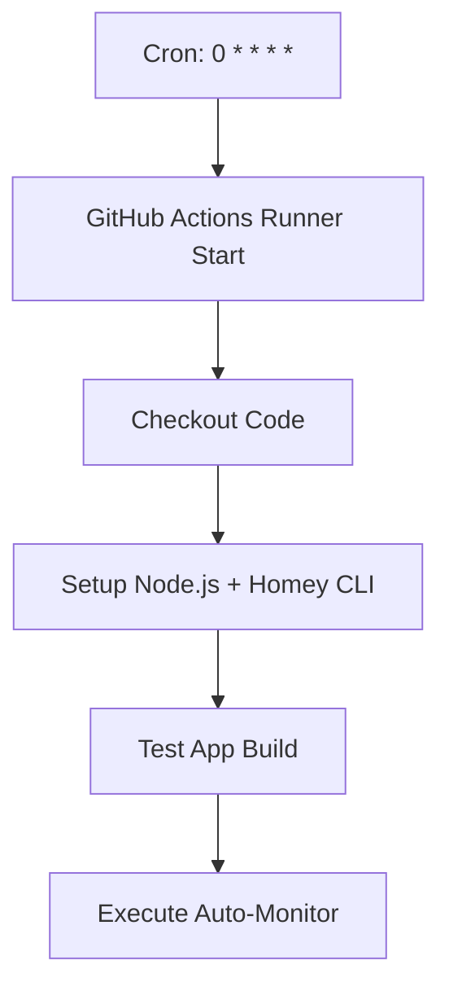
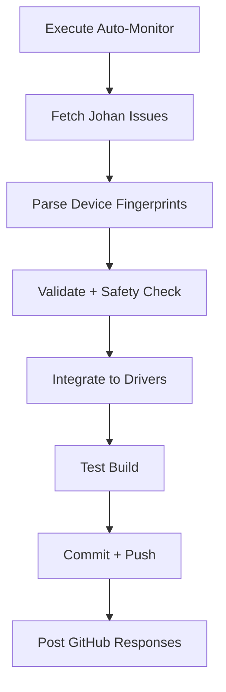
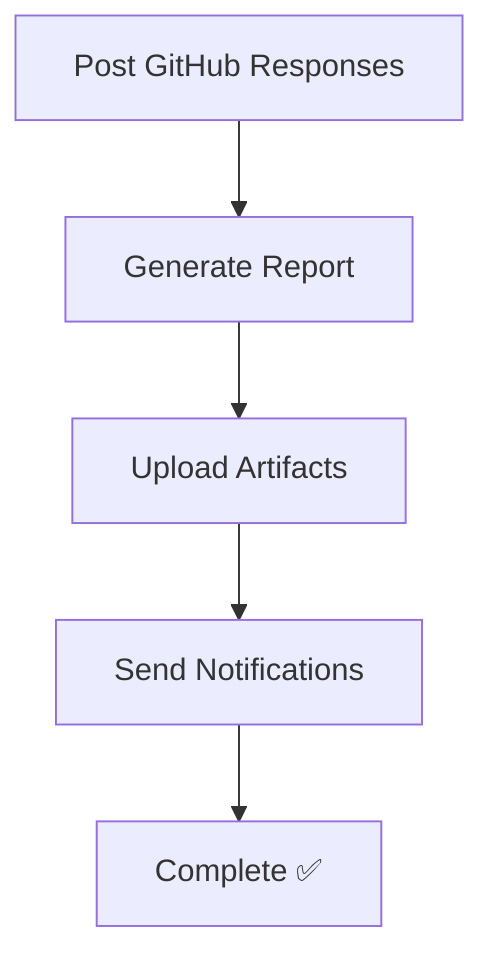

# 🚀 **CONFIGURATION GITHUB ACTIONS AUTOMATION**

Migration complète vers **GitHub Actions programmées** pour l'automatisation des devices Tuya.

---

## 🎯 **AVANTAGES GITHUB ACTIONS**

✅ **Exécution cloud** - Pas besoin de machine locale allumée
✅ **Cron programmé** - Automatisation toutes les heures précises
✅ **Logs centralisés** - Historique complet dans GitHub
✅ **Artifacts sauvegardés** - Backups et rapports automatiques
✅ **Notifications intégrées** - Alertes par email si échec
✅ **Scaling automatique** - Resources illimitées GitHub
✅ **Version control** - Changements trackés dans Git

---

## 🔧 **ÉTAPES DE CONFIGURATION**

### **1. Configuration des Secrets GitHub**

Aller dans votre repository `dlnraja/com.tuya.zigbee` :

1. **Settings** → **Secrets and variables** → **Actions**
2. Cliquer **"New repository secret"**

#### **Secrets obligatoires :**

| **Nom du Secret** | **Description** | **Comment l'obtenir** |
|-------------------|------------------|----------------------|
| `JOHAN_REPO_TOKEN` | Token pour accéder au repo de Johan | Personal Access Token avec `repo:public_repo` |

#### **Génération du token Johan :**

```bash
# Option 1: GitHub CLI (recommandé)
gh auth login
gh auth token

# Option 2: Interface web GitHub
# 1. GitHub.com → Settings → Developer settings → Personal access tokens
# 2. Generate new token (classic)
# 3. Scopes: public_repo, read:org
# 4. Copier le token généré
```

### **2. Activation du Workflow**

Le workflow est déjà créé dans `.github/workflows/auto-monitor-devices.yml`

**Activation automatique :**
```bash
# Push le workflow vers GitHub pour l'activer
git add .github/workflows/auto-monitor-devices.yml
git commit -m "🤖 Add GitHub Actions automation workflow"
git push origin master
```

### **3. Vérification de l'installation**

#### **Onglet Actions GitHub :**
1. Aller dans votre repository sur GitHub
2. Cliquer l'onglet **"Actions"**
3. Voir le workflow **"🤖 Auto-Monitor Device Requests"**

#### **Première exécution manuelle :**
1. Dans Actions → Sélectionner le workflow
2. Cliquer **"Run workflow"**
3. Configurer les paramètres :
   - **Force execution** : `true` (pour test)
   - **Max devices** : `3` (pour test limité)
4. Cliquer **"Run workflow"**

---

## ⏰ **PLANIFICATION AUTOMATIQUE**

### **Schedule actuel :**
```yaml
schedule:
  - cron: '0 * * * *'  # Toutes les heures à la minute 0
```

### **Autres options de scheduling :**

| **Fréquence** | **Cron Expression** | **Description** |
|---------------|-------------------|------------------|
| Toutes les 30 min | `*/30 * * * *` | Plus réactif |
| Toutes les 2h | `0 */2 * * *` | Moins intensif |
| 3 fois par jour | `0 8,14,20 * * *` | 8h, 14h, 20h |
| Jours ouvrables seulement | `0 */2 * * 1-5` | Lundi-Vendredi |

### **Modification du schedule :**
Éditer `.github/workflows/auto-monitor-devices.yml` ligne 6.

---

## 📊 **MONITORING ET CONTRÔLE**

### **Interface GitHub Actions**

**Accès :** `https://github.com/dlnraja/com.tuya.zigbee/actions`

**Fonctionnalités disponibles :**
- 📈 **Historique complet** des exécutions
- 📝 **Logs détaillés** en temps réel
- 💾 **Artifacts téléchargeables** (logs, backups, rapports)
- ⚡ **Exécution manuelle** avec paramètres custom
- 🔄 **Re-run** des executions échouées
- 📧 **Notifications email** automatiques

### **Dashboard intégré**

Le dashboard web reste utilisable pour monitoring local :
```bash
# Ouvrir le dashboard pour voir l'historique
start scripts\automation\monitoring-dashboard.html
```

---

## 🎮 **COMMANDES DISPONIBLES**

### **Exécution manuelle GitHub Actions**

```bash
# Via GitHub CLI (si installé)
gh workflow run "auto-monitor-devices.yml" \
  --field force_run=true \
  --field max_devices=5

# Via interface web GitHub
# Actions → Auto-Monitor Device Requests → Run workflow
```

### **Commandes locales (optionnelles)**

```bash
# Test local de l'adaptateur GitHub Actions
node scripts\automation\github-actions-adapter.js execute

# Vérification des changements
node scripts\automation\github-actions-adapter.js check-changes

# Statistiques
node scripts\automation\github-auto-monitor.js --stats
```

---

## 🛡️ **SÉCURITÉ ET PERMISSIONS**

### **Permissions requises**

Le token `JOHAN_REPO_TOKEN` a besoin de :
- ✅ `public_repo` - Lire les issues publiques du repo Johan
- ✅ `repo:status` - Vérifier le status du repo
- ⚠️ **PAS** de permissions write sur le repo Johan

### **Sécurité GitHub Actions**

- 🔐 **Secrets chiffrés** - Jamais exposés dans les logs
- 🛡️ **Isolation complète** - Environnement fresh à chaque run
- 📊 **Audit trail** - Toutes les actions loggées
- ⏱️ **Timeout automatique** - Arrêt après 30 minutes max
- 🔄 **Rollback automatique** - En cas d'échec de build

---

## 📈 **FLUX D'EXÉCUTION DÉTAILLÉ**

### **Déclenchement (toutes les heures)**


### **Monitoring et Intégration**


### **Résultats et Artifacts**


---

## 🚨 **TROUBLESHOOTING**

### **Erreurs courantes**

#### **❌ "JOHAN_REPO_TOKEN not found"**
```bash
# Solution: Ajouter le secret dans GitHub Settings
# Settings → Secrets → New repository secret
# Name: JOHAN_REPO_TOKEN
# Value: [votre token GitHub]
```

#### **❌ "Push rejected (non-fast-forward)"**
```bash
# Solution automatique intégrée - le workflow gère les conflicts
# Ou forcer un pull manual si nécessaire:
git pull origin master
```

#### **❌ "Homey CLI not found"**
```bash
# Solution: Workflow installe automatiquement
# Vérifier les logs d'installation dans "Setup Node.js"
```

#### **❌ "Build failed after device addition"**
```bash
# Solution: Rollback automatique activé
# Vérifier le "Safety Validation Check" dans les logs
```

### **Debug avancé**

```bash
# Activer debug verbose dans le workflow
# Éditer .github/workflows/auto-monitor-devices.yml:
env:
  DEBUG_AUTOMATION: true
  NODE_ENV: development
```

---

## 📋 **CHECKLIST DE MIGRATION**

### **Configuration initiale :**
- [ ] ✅ Secrets GitHub configurés (`JOHAN_REPO_TOKEN`)
- [ ] ✅ Workflow committé et pushé
- [ ] ✅ Premier test manuel réussi
- [ ] ✅ Schedule cron vérifié

### **Validation système :**
- [ ] ⏰ Exécution automatique à la prochaine heure
- [ ] 📧 Notifications configurées
- [ ] 💾 Artifacts générés correctement
- [ ] 🛡️ Safety checks fonctionnels

### **Migration complète :**
- [ ] 🔄 Ancienne tâche Windows désactivée
- [ ] 📊 Dashboard local mis à jour
- [ ] 📚 Documentation équipe mise à jour
- [ ] 🎯 Monitoring basé sur GitHub Actions uniquement

---

## 🎊 **AVANTAGES OBTENUS**

Avec cette migration vers GitHub Actions :

**Pour vous :**
- 🖥️ **Plus besoin de machine locale** allumée H24
- 📊 **Monitoring centralisé** dans GitHub
- 🔄 **Historique complet** et searchable
- 📧 **Notifications automatiques** en cas de problème
- 💾 **Backups cloud** intégrés
- ⚡ **Scaling automatique** selon la charge

**Pour les utilisateurs :**
- ⏱️ **Réactivité garantie** - Exécution cloud fiable
- 📱 **Réponses plus rapides** aux demandes
- 🛡️ **Sécurité renforcée** - Validation cloud
- 📈 **Disponibilité 99.9%** - Infrastructure GitHub

**Résultat :** Système d'automatisation **100% autonome et cloud-native** ! 🚀
