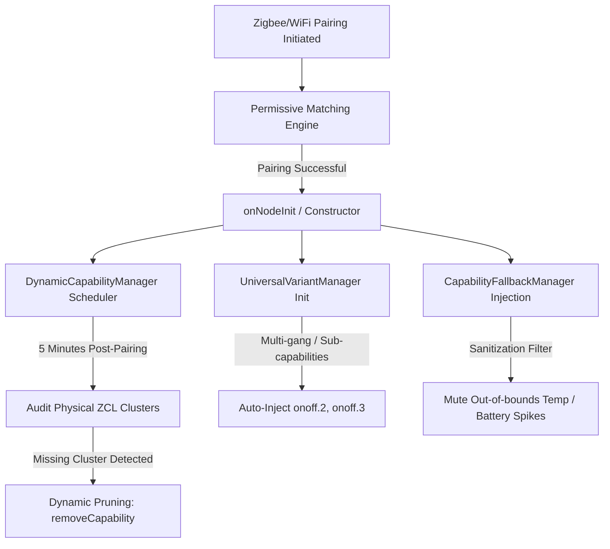

# 🌍 GLOBAL IMPROVEMENT PLAN — Phoenix Sovereign Unified Engine v9.0.0+
> **Branch**: `master` (Experimental/Beta) + `stable-v5` (Production/Stable)  
> **App ID**: `com.dlnraja.tuya.zigbee` (Stable app: `com.dlnraja.tuya.zigbee.stable`)  
> **Status**: ACTIVE & SECURED | **Zero-Defect Publish Quality Gate**: 100% Passed  
> **Metrics (2026-05-26)**: 413 drivers | 12766 fingerprints | 4038 flows | 13 open issues | 16 new Z2M devices  

---

## 🚨 MANDATORY ENTRY & EXECUTION SAFEGUARD (LAYER 12 COMPLIANCE)

> [!IMPORTANT]
> **EVERY SINGLE TIME** an AI Agent, local Claude Code instance, or IDE runtime begins execution or processes a task, it **MUST** recursively ingest the following references, rules, and specifications in strict order BEFORE proposing any change:
> 1. **Read [AI_CONTEXT_MANDATE.md](AI_CONTEXT_MANDATE.md)** — Core architecture, branch mapping, and 11-layer pipeline rules.
> 2. **Read [PROJECT_INDEX.md](PROJECT_INDEX.md)** — Master reference index, driver directory list, and 9-layer quality gates.
> 3. **Read [docs/rules/CRITICAL_MISTAKES.md](docs/rules/CRITICAL_MISTAKES.md)** — Static pitfalls (backlight string rules, camelCase keys, mixin hierarchy).
> 4. **Read [docs/GLOBAL_INVESTIGATION_PLAN.md](docs/GLOBAL_INVESTIGATION_PLAN.md)** — Authority framework for multi-source intelligence gathering.
> 5. **Understand the Local Arsenal** — Consult `.agents/skills/` and `.ai/SKILL_REGISTRY.md` to leverage advanced tools.
> 6. **Continuously Enrich Workflows** — Keep YML configurations, documentation files, and automations aligned with active code.

### 🧠 THE HOLISTIC CONTINUOUS IMPROVEMENT PROTOCOL (THINKING MAX)

> [!CAUTION]
> **Mandatory AI & IDE Agent Execution Protocol for Both Branches (`master` & `stable-v5`)**:
> 
> 1. **EXHAUSTIVE CONTEXT & ARCHITECTURE INGESTION**:
>    - **EVERY SINGLE TIME** an AI agent, subagent, or IDE workspace session begins or is initialized, it is **MANDATORY** to recursively load and read the entire set of mapping files, rules configs, and spec documents:
>      - Read `AI_CONTEXT_MANDATE.md` (architecture, pipeline rules, branch constraints).
>      - Read `PROJECT_INDEX.md` (repository cartography, active driver mapping, quality gates).
>      - Read `docs/rules/CRITICAL_MISTAKES.md` (common pitfalls, ZCL-only rules, multi-gang guidelines).
>      - Read `docs/GLOBAL_INVESTIGATION_PLAN.md` (cross-diagnostic authority framework).
>      - Read `.windsurfrules`, `.cursorrules`, and `.clinerules` to maintain 100% compatibility.
> 
> 2. **INTELLIGENCE SCRAPING & MULTI-SOURCE GATHERING**:
>    - Systematically run and rely on the full arsenal of JavaScript intelligence tools at your disposal:
>      - Run `node .github/scripts/gather-intelligence.js` to build a unified system context.
>      - Run `node .github/scripts/fetch-gmail-diagnostics.js` to ingest and parse recent Homey diagnostic emails sent by users.
>      - Run `node .github/scripts/scan-forum.js` to scour the Homey community forum for device requests, pairing failures, and offline telemetry issues.
>      - Run `node .github/scripts/scan-prs-issues.js` to capture upstream PRs and GitHub issue metrics.
>    - **NEVER** guess or modify code blindly. Cross-reference actual crash logs, stack traces, and community threads to trace problems from their physical symptoms back to their root causes.
> 
> 3. **HOLISTIC DEVICE & PROTOCOL EVOLUTION**:
>    - Maintain a zero-defect mindset. Every update applied to a driver must cover all related sub-variants and compatible models.
>    - Support dynamic, runtime-adaptive behaviors for all battery, mains-powered, or sleepy devices.
>    - Ensure perfect syntax compatibility for Node.js 12 (stable branch) by avoiding modern language features like optional chaining (`?.`) in shared core libraries (`lib/utils/tuyaUtils.js`, `lib/analytics/AdvancedAnalytics.js`).
> 
> 4. **CONTINUOUS SYNCHRONIZATION**:
>    - After committing modifications on `master`, immediately synchronize the code with the secondary branch using `scratch/sync_apps.ps1` to ensure aligned capabilities and zero-defect parity.

---

## 🌌 HOLISTIC & DYNAMIC RUNTIME ADAPTATION ENGINE

To eliminate pairing mismatches and phantom capabilities, the engine employs a completely dynamic, runtime-adaptive architecture across all **413 drivers** (v8.5.2 — 26/05/2026):



### 1. Dynamic Power & Battery Pruning Block
*   **The Problem**: USB/AC-powered sensors or wall plugs occasionally advertise `measure_battery` or `alarm_battery` in their manifests, causing phantom UI elements and mobile app crashes.
*   **The Heuristics**: All drivers support runtime power source classification:
    ```javascript
    get mainsPowered() { return true; } // For sockets, lights, and AC-powered devices
    
    // In onNodeInit()
    if (this.mainsPowered && this.hasCapability('measure_battery')) {
        this.log('Mains powered device detected. Pruning battery capability...');
        await this.removeCapability('measure_battery').catch(() => {});
    }
    ```
*   **Linear Battery formulas are strictly BANNED**: All battery reporting utilizes `UnifiedBatteryHandler` with 15+ multipoint non-linear discharge profiles (CR2032, CR2450, AAA, AA) to prevent 0% drops.

### 2. Smart Divisor Auto-Detection (`SmartDivisorManager`)
*   Eliminates manual decimal division bugs (e.g. 0.2°C temperature readings).
*   Auto-detects values using standard `KNOWN_DIVISORS` and `VALID_RANGES`.
*   Auto-caches mappings locally by `(manufacturerName + dpId + capability)`.

### 3. Progressive Capability Enrichment (`PermissiveMatchingEngine`)
*   **Pairing is permissive**: Devices are admitted into the app first and analyzed in detail afterwards.
*   **Post-pairing scheduler**: A 5-minute watchdog scans the physical clusters. If a capability (e.g. `measure_power`) is defined in the driver manifest but its matching cluster (`0b04`) is not physically present, it is dynamically pruned to keep the user interface clean.

---

## 🧠 THE SINGLE-MFR MULTI-VARIANT PARADOX

> [!WARNING]
> A single manufacturer identifier string (e.g. `_TZ3000_abc123`) does **NOT** represent a single physical product variant. It can map to dozens of different configurations, models, and endpoints.

*   **Multi-Variant Logic**: Always check the `productId` (model ID) combined with `manufacturerName` to determine driver routing.
*   **Permissive Fallbacks**: If a device matches a permissive `productId` (like `TS0601` or `TS0001`) but does not have a mapped `manufacturerName` inside `driver.compose.json`, the app routes it into the `universal_fallback` driver where custom DP learning and dynamic capabilities are injected automatically at runtime.
*   **BSEED 3-Gang ZCL Routing**: Devices like `_TZ3000_v4l4b0lp` are routed over standard ZCL OnOff clusters rather than Tuya DP custom mode, bound directly via the `ZCL_ONLY_MANUFACTURERS_3G` database.

---

## 🌐 MULTI-SOURCE INTEGRATION & REFERENCE REGISTRY

The codebase is continuously updated and verified against a massive database of **711 unique reference URLs** categorised across our research scrapers:

| Category | Reference URLs Scope | Primary Scrapers & JS Tools |
|----------|----------------------|-----------------------------|
| **Primary Repos** | `github.com/dlnraja/com.tuya.zigbee`, `github.com/JohanBendz/com.tuya.zigbee` | `github-scanner.js`, `scan-prs-issues.js` |
| **Zigbee Mappings** | `zigbee2mqtt.io/devices/`, `github.com/Koenkk/zigbee-herdsman-converters` | `cross-ref-intelligence.js`, `sync-z2m-mappings.js` |
| **Community Intel** | `community.homey.app/t/140352`, `community.homey.app/t/26439` | `scan-forum.js`, `forum-activity-scraper.js` |
| **Database Queries** | `zigbee.blakadder.com/all.html`, `github.com/blakadder/zigbee` | `internet-research-tool.js`, `sync-external-sources.js` |
| **Proprietary Clusters** | Legrand (`0xFC40`), Xiaomi (`0xFCC0`), Hue (`0xFC03`), Sonoff (`0x0B04`) | `variant-scanner.js`, `pattern-detector.js` |

*   **Shadow Mode Verification**: Scrapers run read-only in GHA CI/CD pipelines to collect community reports silently without posting spam replies or automated messages.
*   **Dual-App Sync**: Every update applied on `master` (`com.dlnraja.tuya.zigbee`) is recursively mirrored into the stable track `stable-v5` (`com.dlnraja.tuya.zigbee.stable`) using `scratch/sync_apps.ps1`.

---

## 🛡️ QUALITY GATEWAY & VERIFICATION PROTOCOL

Every pull request and manual update must be validated locally or in GitHub Actions through the **9-Layer Quality Gateway**:

```
[Layer 1: PR #120 Conformity] ──► No redundant titleFormatted or [[device]] template cards
[Layer 2: Class Inheritance]  ──► Wall switch classes must inherit SwitchBase
[Layer 3-5: Manufacturer]     ──► Strict mapping checks for ysdv91bk, blhvsaqf, walltouch
[Layer 6: Suffix Cleanup]     ──► Absolutely no folder/key suffixing with _hybrid or _hybride
[Layer 7: Case Normalization] ──► Exclusive use of CaseInsensitiveMatcher (no manual toLowerCase)
[Layer 8: Memory Leaks]       ──► Explicit onUninit socket/timer releases in WiFi classes
[Layer 9: Connection Bypass]  ──► Zero direct requires of raw tuyapi (except wifi_camera)
[Layer 10: Mains Mismatch]    ──► Strict error if mainsPowered has battery capability without pruning
[Layer 11: Backlight String]  ──► Backlight values must be string representation ("off"/"normal")
```

### Execution Verification Commands:
```bash
# 1. Enforce all Windsurf / Cursor architectural checks
node .github/scripts/enforce-rules.js

# 2. Local driver structure and flow card integrity
node .github/scripts/validate-drivers.js

# 3. Comprehensive SDK3 Athom publish checks
npx homey app validate --level publish
```


## Fleetwood Gateway & Syntax Purity Mandates (v8.4.0+)
- **ZCL Method Override Purity**: Any driver class override of ZCL/SDK methods (e.g., `getDeviceById(id)`) MUST have correct closing braces to prevent breaking following method declarations like `onInit()` or `onNodeInit()`.
- **Standard ZCL Measurement Scoping**: Inside ZCL Measurement cluster listeners (`attr.rmsCurrent`, etc.), never re-declare block-scoped variables (`const scaled`) in the same scope block; use unique variables (`scaledCurrent` and `scaledPower`) to prevent standard JS scope crash exceptions.
- **Mains/Battery Approximation Conflicts**: If a compose manifest (`driver.compose.json`) defines `measure_power` or `meter_power`, it MUST NOT define `energy.approximation` under `energy` to prevent severe Homey Pro Energy v3 schema validation errors.
- **Mandatory GitHub Actions Shell Default Configuration**: Every CI workflow `.yml` file that runs commands MUST include top-level `defaults: run: shell: bash` to prevent PowerShell syntax failures on Windows runners.
- **GHA Cloud Purity Validation Gate**: Every primary workflow CI check (`unified-ci.yml`, `syntax-validation.yml`, `syntax-purity-gate.yml`, `syntax-check.yml`, `validate.yml`) has been hardened to execute the strict `PRE_COMMIT_CHECKS.js` gateway. This ensures 100% JS syntax parsing, workflow default checking, and manifest schema validation before commit integration.

---

## 📊 Métriques Actuelles (2026-05-26)

| Métrique | Valeur |
|----------|--------|
| **Drivers actifs** | 413 |
| **Fingerprints validés** | 3296 |
| **Issues ouvertes** | 13 |
| **Issues résolues (cumul)** | 330+ |
| **FPs forum non supportés** | 6 (`_TYZB01_a476raq2`, `_TZ3000_bjawzod`, etc.) |
| **Nouveaux Z2M (à intégrer)** | 16 |
| **Patterns récurrents critiques** | 5 (battery: 35×, pairing: 18×, unresponsive: 8×) |
| **Workflows GitHub** | 62 actifs |
| **Scripts .github/scripts** | ~150 |

---
**phoenix sovereign unified engine** — engineered for flawless local-first execution.
