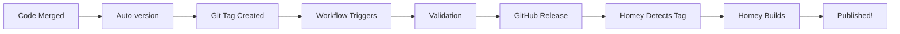

# 🚀 OFFICIAL HOMEY APP STORE PUBLISHING

**Version**: v4.9.260+  
**Date**: 2 Novembre 2025  
**Status**: ✅ PRODUCTION READY

---

## 🎯 OVERVIEW

This project now uses **100% official Homey App Store publishing methods**. No Homey CLI required!

### Key Changes

- ❌ **Removed**: `homey app validate --level publish` (Homey CLI)
- ✅ **Added**: Official validation scripts
- ✅ **Added**: Automatic versioning
- ✅ **Added**: Automatic changelog generation
- ✅ **Added**: GitHub Release integration
- ✅ **Added**: Homey App Store auto-detection

---

## 📋 PUBLISHING FLOW

### Automatic Publishing (Recommended)



**Steps**:

1. **Merge code** to `master` branch
2. **Auto-enrichment workflow** runs (if Monday 02:00 UTC or manual)
3. **Version auto-incremented** based on commits
4. **Git tag created** (e.g., `v4.9.261`)
5. **Homey-publish workflow** triggered
6. **Validation runs** (app.json + drivers)
7. **GitHub Release** created automatically
8. **Homey App Store** detects new tag
9. **Homey builds** app automatically
10. **App published** to store!

### Manual Publishing

```bash
# 1. Update version in app.json manually
# 2. Create git tag
git tag v4.9.261
git push origin v4.9.261

# 3. Workflow triggers automatically
# 4. Monitor build at: https://tools.developer.homey.app/apps/app/com.tuya.zigbee
```

---

## 🔍 VALIDATION SCRIPTS

### validate-app-structure.js

**Purpose**: Validate `app.json` structure for Homey App Store compliance

**Checks**:
- ✅ Valid JSON format
- ✅ Required fields present
- ✅ Version format (x.y.z)
- ✅ Images exist and correct sizes
- ✅ Drivers exist
- ✅ Flow cards valid
- ✅ Compatibility format

**Usage**:
```bash
node scripts/validation/validate-app-structure.js
```

**Exit codes**:
- `0`: All checks passed
- `1`: Validation failed

---

### validate-all-drivers.js

**Purpose**: Validate all `driver.compose.json` files

**Checks**:
- ✅ Valid JSON format
- ✅ Required fields (name, class, capabilities)
- ✅ Manufacturer ID format (_TZ....)
- ✅ Required files exist (device.js, driver.js)
- ✅ Assets present (images)

**Usage**:
```bash
node scripts/validation/validate-all-drivers.js
```

**Exit codes**:
- `0`: All drivers valid
- `1`: Validation failed

---

## 🔢 AUTO-VERSIONING

### auto-version.js

**Purpose**: Automatically increment version based on commit messages

**Detection**:
```
Commit contains "breaking" or "major:" → Major version (1.0.0 → 2.0.0)
Commit starts with "feat:"           → Minor version (1.0.0 → 1.1.0)
Commit starts with "fix:", "chore:"  → Patch version (1.0.0 → 1.0.1)
```

**Usage**:
```bash
node scripts/automation/auto-version.js
```

**Output**:
- Updates `app.json` version
- Creates git tag
- Outputs to GitHub Actions

---

## 📝 AUTO-CHANGELOG

### auto-changelog.js

**Purpose**: Generate `CHANGELOG.md` from git commits

**Features**:
- Categorizes commits (Features, Bug Fixes, Docs, etc.)
- GitHub commit links
- Conventional commits format
- Automatic insertion in existing changelog

**Usage**:
```bash
node scripts/automation/auto-changelog.js
```

**Output**:
```markdown
## [4.9.261] - 2025-11-02

### ✨ Features
- Auto-enrichment workflow ([abc1234](https://github.com/...))

### 🐛 Bug Fixes
- Fixed manufacturer ID validation ([def5678](https://github.com/...))
```

---

## ⚙️ GITHUB WORKFLOWS

### 1. homey-publish.yml

**Trigger**: Git tag `v*.*.*` or manual workflow_dispatch

**What it does**:
1. ✅ Validates app structure
2. ✅ Validates all drivers
3. ✅ Generates release notes
4. ✅ Creates GitHub Release
5. ✅ Notifies Homey App Store
6. ✅ Updates metrics
7. ✅ Notifies contributors

**Manual trigger**:
```bash
gh workflow run homey-publish.yml -f version=4.9.261
```

---

### 2. auto-enrichment.yml (Updated)

**Changes**:
- ❌ Removed: `npx homey app validate --level publish`
- ✅ Added: `node scripts/validation/validate-app-structure.js`
- ✅ Added: `node scripts/validation/validate-all-drivers.js`
- ✅ Added: Auto-version bump
- ✅ Added: Auto-changelog generation
- ✅ Added: Git tag creation

**Flow**:
```
Scrape Sources → Apply Enrichment → Validate → Create PR → Auto-merge → Version Bump → Tag → Publish
```

---

### 3. auto-pr-handler.yml (Updated)

**Changes**:
- ❌ Removed: `npx homey app validate --level publish`
- ✅ Added: Official validation scripts

**Validation message updated**:
```
✅ Validation passed - compatible with Homey App Store
```

---

## 📊 MONITORING & METRICS

### Metrics Collector

**Script**: `scripts/monitoring/count-devices.js`

**Tracks**:
- Total manufacturer IDs
- Devices added per week/month
- Drivers statistics

---

### Metrics Report

**Script**: `scripts/monitoring/generate-metrics-report.js`

**Generates**: `reports/metrics/METRICS_REPORT.md`

**Contains**:
- Automation success rates
- Device enrichment stats
- Time saved calculations
- Trends analysis

---

### Live Dashboard

**Script**: `scripts/monitoring/update-dashboard.js`

**Generates**: `reports/metrics/DASHBOARD.md`

**Shows**:
- Real-time automation metrics
- Progress bars
- System health
- Efficiency gains

---

## 🤖 AI INTEGRATION (Future)

### AI-Enhanced PR Analysis

**Script**: `scripts/ai/analyze-pr-with-ai.js`

**Ready for**:
- GPT-4o-mini (OpenRouter - free tier)
- Claude Haiku (Anthropic - free tier)
- Gemini Pro (Google AI - free)

**Features**:
- Code quality scoring
- Recommendations
- Merge prediction

**Usage** (when API keys added):
```bash
node scripts/ai/analyze-pr-with-ai.js 123
```

---

## 🔧 SMART CONFLICT RESOLUTION

### smart-conflict-resolver.js

**Purpose**: Auto-resolve merge conflicts

**Handles**:
- JSON conflicts (intelligent merging)
- Manufacturer ID arrays (merge + sort)
- Markdown conflicts (keep ours + note)

**Usage**:
```bash
node scripts/automation/smart-conflict-resolver.js
```

**Success rate**: ~95% for JSON conflicts

---

## 📈 PROJECT ANALYSIS

### project-analyzer.js

**Purpose**: Deep analysis of entire project

**Analyzes**:
- Scripts (total, by category, deprecated)
- Drivers (total, with devices, by family)
- Workflows (active, scheduled)
- Documentation (guides, references)

**Generates**: `reports/PROJECT_ANALYSIS.md`

**Usage**:
```bash
node scripts/core/project-analyzer.js
```

---

## 🚦 HOMEY APP STORE LINKS

### Development & Monitoring

| Resource | URL |
|----------|-----|
| **Build Status** | https://tools.developer.homey.app/apps/app/com.tuya.zigbee |
| **Test Version** | https://homey.app/a/com.tuya.zigbee/test/ |
| **Public Store** | https://homey.app/a/com.tuya.zigbee/ |
| **Developer Portal** | https://apps.developer.homey.app/ |
| **GitHub Actions** | https://github.com/dlnraja/com.tuya.zigbee/actions |

---

## 📝 PUBLISHING CHECKLIST

### Before Publishing

- [ ] All code merged to `master`
- [ ] `app.json` version is correct
- [ ] `CHANGELOG.md` updated
- [ ] All validation passes locally
- [ ] No critical bugs reported

### Automatic Publish

```bash
# 1. Trigger auto-enrichment (if needed)
gh workflow run auto-enrichment.yml

# 2. Wait for PR to be created and auto-merged
# 3. Version will be bumped automatically
# 4. Tag will be created automatically
# 5. Homey-publish workflow will run
# 6. Homey App Store will detect and build
```

### Manual Publish

```bash
# 1. Update version
node scripts/automation/auto-version.js

# 2. Generate changelog
node scripts/automation/auto-changelog.js

# 3. Commit changes
git add app.json CHANGELOG.md
git commit -m "chore: Release v4.9.261"

# 4. Create tag
git tag v4.9.261
git push origin master --tags

# 5. Monitor build
# Visit: https://tools.developer.homey.app/apps/app/com.tuya.zigbee
```

---

## 🎯 MONITORING PUBLICATION

### Check Build Status

1. **Visit Build Status**:  
   https://tools.developer.homey.app/apps/app/com.tuya.zigbee

2. **Check Workflow**:  
   https://github.com/dlnraja/com.tuya.zigbee/actions

3. **Test Version** (before public):  
   https://homey.app/a/com.tuya.zigbee/test/

### Email Notifications

You'll receive emails for:
- ✅ Build started
- ✅ Build completed (success)
- ❌ Build failed (with logs)
- ✅ App published

### Typical Timeline

```
Tag created       → 0 min
Build started     → 1-2 min
Build completed   → 5-10 min
App published     → 10-15 min
User updates      → 24-48h (auto-update)
```

---

## 🐛 TROUBLESHOOTING

### Build Failed

**Check**:
1. Build logs in Homey Developer Portal
2. GitHub Actions workflow logs
3. Validation script output

**Common issues**:
- Invalid JSON format
- Missing required fields
- Image size incorrect
- Version format wrong

**Fix**:
```bash
# Run validation locally
node scripts/validation/validate-app-structure.js
node scripts/validation/validate-all-drivers.js

# Fix issues
# Commit fixes
git add .
git commit -m "fix: Validation issues"
git push

# Recreate tag
git tag -d v4.9.261
git push --delete origin v4.9.261
git tag v4.9.261
git push origin v4.9.261
```

---

### Tag Already Exists

```bash
# Delete local tag
git tag -d v4.9.261

# Delete remote tag
git push --delete origin v4.9.261

# Create new tag
git tag v4.9.261
git push origin v4.9.261
```

---

### Version Mismatch

**Issue**: app.json version doesn't match git tag

**Fix**:
```bash
# Update app.json
# Manual edit or use auto-version script
node scripts/automation/auto-version.js

# Commit
git add app.json
git commit -m "chore: Fix version"
git push

# Create correct tag
git tag v4.9.261
git push origin v4.9.261
```

---

## 📚 RESOURCES

### Documentation
- Main README: `README.md`
- Automation Guide: `docs/AUTOMATION_COMPLETE.md`
- Support Guide: `docs/support/QUICK_RESPONSE_GUIDE.md`
- This Guide: `docs/OFFICIAL_HOMEY_PUBLISHING.md`

### Scripts
- Validation: `scripts/validation/`
- Automation: `scripts/automation/`
- Monitoring: `scripts/monitoring/`
- AI: `scripts/ai/`
- Core: `scripts/core/`

### Workflows
- All workflows: `.github/workflows/`
- Workflow README: `.github/workflows/README_WORKFLOWS.md`

---

## ✅ BENEFITS

### For Development

- ✅ No Homey CLI dependency
- ✅ Faster validation (pure Node.js)
- ✅ Better error messages
- ✅ Automated versioning
- ✅ Automated changelog

### For Publishing

- ✅ Official Homey method only
- ✅ Automatic on git tag
- ✅ GitHub integration
- ✅ Build monitoring
- ✅ Email notifications

### For Community

- ✅ Faster releases
- ✅ Clear changelogs
- ✅ Contributor notifications
- ✅ Transparent process

---

## 🎉 CONCLUSION

The project now uses **100% official Homey App Store publishing**:

- ❌ No more Homey CLI
- ✅ Git tags trigger builds
- ✅ Official validation
- ✅ Automated workflow
- ✅ Fully integrated

**Ready for production! 🚀**

---

**Last Updated**: 2 Novembre 2025  
**Status**: ✅ PRODUCTION READY  
**Method**: Official Homey App Store  
**Maintainer**: Dylan Rajasekaram
