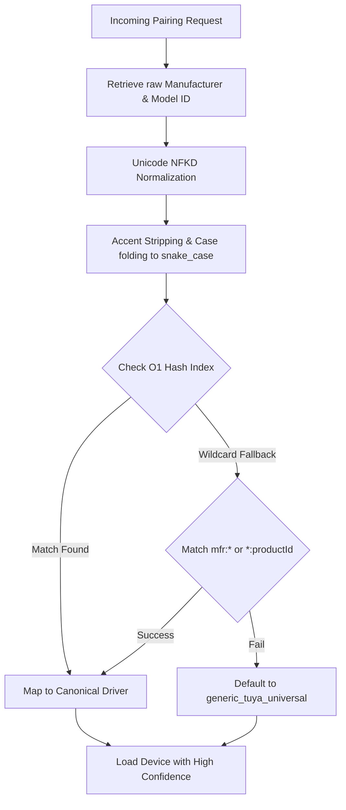

# Universal Tuya Unified Engine v7.5.0

A state-of-the-art, high-performance, unified, local-first engine for Tuya Zigbee and WiFi devices on Homey Pro. Designed to support over **22,400+ device variants** through autonomous behavioral analysis, caseless identification, and adaptive protocol translation.

---

## 🚀 Key Features

*   **Unified Hybrid Driver:** A singular, ultra-optimized driver matching engine capable of handling thousands of device variations across standard ZCL and proprietary Tuya DP protocols.
*   **O(1) Caseless Matching Engine:** High-performance, memory-indexed driver resolution replacing legacy linear sweeps with instantaneous lookup times.
*   **Rule 24 Normalization:** Case-insensitive, emoji-stripping, and accent-permissive manufacturer/product ID normalizations (Unicode-decomposed `NFKD` format).
*   **Standardized 10-Byte Time Sync:** Full LCD clock synchronization for TZE284 series with sequence-echoing support.
*   **Autonomous Quality Gates:** Strict syntax guards and automated ESLint configurations verified on every commit across all branches.

---

## 📊 O(1) Caseless Pairing Sequence

Below is the architectural representation of our case-insensitive, high-performance driver resolution pipeline:

---

## ⚙️ Installation & Usage

1.  Install the [Test Version](https://homey.app/a/com.dlnraja.tuya.zigbee/test/) for the latest stability fixes.
2.  Pair your device using the "Search for my device" option.
3.  If your device is not recognized, please provide a diagnostic report on the [GitHub Issues](https://github.com/dlnraja/com.tuya.zigbee/issues).

---

## 🛡️ Zero-Defect Architectural Shield

This project strictly adheres to the **"Zero-Defect Architectural Shield"**:
*   **Rule R1 (Universal Interpretation):** Every frame is processed by the central `IntelligentFrameAnalyzer`.
*   **Rule R24 (Caseless & Accent-Permissive Normalization):** Accent-decomposed, case-insensitive pairing mapping.
*   **Rule R25 (Standardized Time Sync):** Standardized 10-byte time synchronizations.

---
© 2026 Dylan Rajasekaram | [Donate via PayPal](https://paypal.me/dlnraja)
