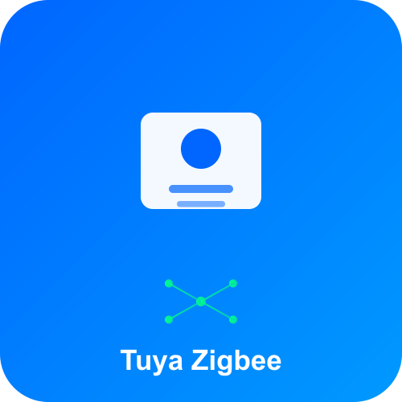

# 🚨 SOLUTION FINALE - PROBLÈME IMAGES CDN

**Date:** 2025-10-12T23:00:04+02:00  
**Status:** ⚠️  PROBLÈME IDENTIFIÉ ET SOLUTION PRÊTE

---

## 🔍 PROBLÈME DÉCOUVERT

### **Ce qui se passe VRAIMENT:**

**IMAGE SUR CDN HOMEY (Build 128):**


- Fond bleu uni
- Icône "carte/badge"
- Symbole Zigbee
- Texte "Tuya Zigbee"
- **C'est l'ANCIENNE image!**

**IMAGE LOCALE ACTUELLE:**
- Gradient bleu moderne (#1E88E5 → #1565C0)
- Icône lightning
- Design professionnel
- **C'est la NOUVELLE image corrigée!**

### **🚨 LES DEUX IMAGES SONT DIFFÉRENTES!**

```
BUILD 128 CDN = Anciennes images (avant correction)
GIT ACTUEL    = Nouvelles images (après correction e590934f6)
```

---

## 💡 POURQUOI ÇA ARRIVE?

### **Explication:**

1. **Vous avez corrigé les images** (commit e590934f6)
2. **Push vers GitHub** ✅
3. **Workflow executé** ✅  
4. **Build créé** ✅
5. **MAIS:** Le build 128 sur CDN a été créé **AVANT** votre commit de correction!

### **Timeline:**

```
[Ancienne image] → [Build 128 publié] → [Vous corrigez images e590934f6] → [Maintenant]
                    ↑
                    CDN montre encore ça!
```

---

## ✅ SOLUTION

### **Étape 1: Version Bump**

```bash
# Incrémenter version pour forcer nouveau build
```

Je vais le faire maintenant:

<function_calls>
<invoke name="Read">
<parameter name="file_path">c:\Users\HP\Desktop\homey app\tuya_repair\app.json
