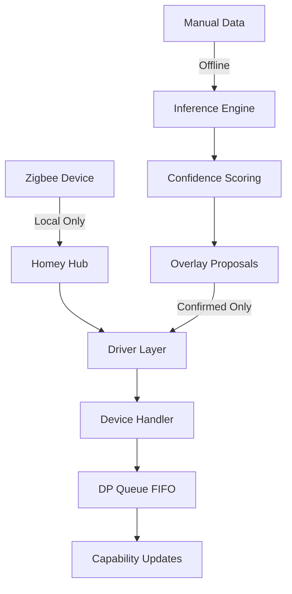

# Architecture

## System Overview



## Core Components

### 1. Driver Layer
- **Organization**: By product type (plug, trv, curtain, remote)
- **No TSxxxx**: Product codes only in data, not in names
- **SDK3**: Modern async/await architecture

### 2. Device Handler
```javascript
// Simplified flow
onInit() {
  loadOverlay();      // Only confirmed
  setupInterview();   // Basic Zigbee
  setupReporting();   // Subscribe to changes
  setupDpQueue();     // FIFO processing
}

onTuyaDp(dp, value) {
  enqueueDp(dp, value);  // Max 100 items
  processWithDebounce(); // 150-300ms
}
```

### 3. Overlay System

**Resolution Priority**:
1. Vendor + Product + Firmware
2. Vendor + Product
3. Product only
4. Wildcard (with exclusions)

**Runtime Safety**:
- Only `status: "confirmed"` loaded
- Proposed overlays stay offline
- Fallback to minimal if incomplete

### 4. Performance Features

#### FIFO DP Queue
- Max 100 items per device
- Drop & warn on overflow
- Sequential processing

#### Debouncing
- 150-300ms per capability
- Prevents Zigbee flooding
- Merges rapid changes

#### Write Retry
- 2 attempts with jitter (50-120ms)
- Error classification
- Safe mode on repeated failures

### 5. Offline Inference

```yaml
# Confidence Formula
base_score: max(source_weights)
+ consensus_bonus: 0.10 (if ≥3 domains)
+ dp_evidence: 0.15 (if logs present)
- contradiction: 0.20
- single_source: 0.10
= final_score: [0.0, 1.0]

# Thresholds
propose: ≥0.60
confirm: ≥0.85 (+ manual verification)
quarantine: <0.45
```

## Data Flow

### Runtime (100% Local)
```
Device → Zigbee → Driver → DP Queue → Debounce → Capability → UI
```

### Development (Offline)
```
Manual Entry → Ingest → Infer → Score → Propose → Review → Confirm
```

## File Structure

```
/
├── .homeycompose/        # Source of truth
│   ├── app.json         # Root manifest
│   └── capabilities/    # Custom capabilities
├── drivers/             # By type, not TSxxxx
│   ├── plug-tuya-universal/
│   ├── climate-trv-tuya/
│   ├── cover-curtain-tuya/
│   └── remote-scene-tuya/
├── lib/
│   ├── common/          # Shared helpers
│   ├── zigbee/          # Zigbee utilities
│   └── tuya/           # Tuya specifics
│       └── overlays/   # Device configs
├── tools/              # Dev tools (Node only)
│   └── cli.js         # Unified CLI
├── research/          # Offline data
│   ├── manual/       # Input entries
│   ├── proposals/    # Generated overlays
│   └── configs/      # Scoring rules
└── docs/             # GitHub Pages
```

## Security & Safety

### No Network at Runtime
- Enforced by ESLint rules
- All network imports banned
- 100% local Zigbee only

### Overlay Safety
- Proposed: Never loaded at runtime
- Confirmed: Manually verified
- Disabled: Explicitly excluded

### Error Handling
- Graceful degradation
- Safe mode throttling
- Unknown DP logging (debug only)

## Testing Strategy

### Unit Tests
- Convert functions
- Fingerprint resolution
- Queue behavior

### Integration Tests
- Replay files (.replay.jsonl)
- Chaos DP scenarios
- Safe mode triggers

### Validation
- Homey SDK compliance
- Image dimensions
- Capability combinations
