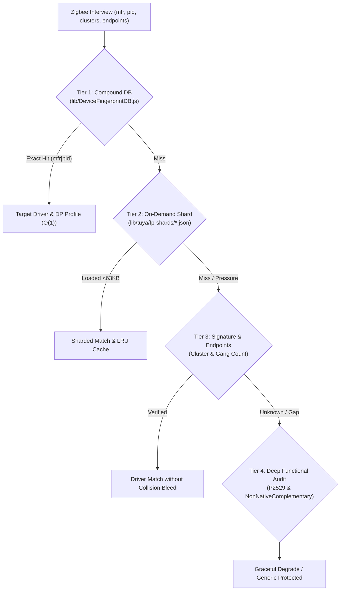

# MFR-PID Scale Intelligence & Multi-Variant Architecture (P2752)

> Comprehensive reference for managing thousands of Tuya hardware variants, pairings, and user requests across Homey apps without cross-class collisions or invented identifiers.

---

## 1. Context & The Scale Challenge

In the Tuya Zigbee ecosystem, Tuya operates as an OEM/ODM provider:
- A single manufacturer identifier (e.g. `_TZ3000_...`, `_TZE200_...`, `_TZE204_...`, `_TZE284_...`) is shared across **hundreds or thousands of completely different hardware devices**:
  - 1-gang to 4-gang switches and relays (`TS0001`, `TS0002`, `TS0003`, `TS0004`, `TS0011`, `TS0012`)
  - Scene switches and wireless buttons (`TS0041`, `TS0042`, `TS0043`, `TS0044`, `TS004F`)
  - Curtain and roller blind motors (`TS0601`, `TS130F`)
  - TRV radiator valves and wall thermostats (`TS0601`, `TS0115`)
  - mmWave radar presence sensors (`TS0601`, `TS0225`)
  - Climate / temperature / humidity sensors (`TS0201`, `TS0601`)
  - Energy monitoring smart plugs (`TS011F`, `TS0121`)
- Conversely, ubiquitous product IDs like `TS0601` or `TS004F` represent dozens of incompatible device categories.
- **The Core Rule:** An identity is strictly defined by the couple **`(manufacturerName, productId)`**, augmented by cluster and endpoint signatures. **Never invent, guess, or cross-pollinate a productId.**

---

## 2. Multi-Tier Resolution Hierarchy

To handle this massive cardinality while respecting Homey Pro's 64MB memory limit, the architecture uses a 4-tier resolution pipeline:

### Tier 1: Compound Key Matching (`mfr|pid`)
- Located in `lib/DeviceFingerprintDB.js`.
- Key format: `_TZE204_gkfbdvyx|TS0601` or `_TZ3000_famkxci2|TS0043`.
- Exact, caseless (`exact_ci`), zero-allocation lookup that pins the exact driver and datapoint map.
- Protected by `publish-sacred-keep-couples.json` so Athom matrix compaction never drops verified couples.

### Tier 2: Dynamic Sharding (`fp-shards`)
- The broad catalog (>5,700 keys) is split into 227 small JSON shards (max 63KB each).
- Shards are loaded **on-demand only** when a specific manufacturer is paired.
- Under memory pressure (`BootBudget.isMemoryPressure()`), shards are evicted via LRU (`evictLruShards`), guaranteeing that Homey Pro never crashes due to `Builtin_JsonParse` OOM.

### Tier 3: Cluster & Endpoint Signature Gate
- Eliminates fake cluster requirements (e.g. IAS Zone `1280` or `1281` removed from `button_wireless_3` so devices without security clusters pair instantly).
- Prevents collision bleed across different gang counts and classes (e.g. `button_wireless_1` cannot steal `remote_button_wireless` or `button_wireless_4`).

### Tier 4: P2529 Deep Functional Audit
- Beyond pairing locks, audits DPs (`101..120`, `200..250`), flow card wiring, bidirectional UI/UX state synchronization, and RX-TX redundancy (`lib/io/NonNativeComplementary.js`).

---

## 3. Sacred Invariants & Rules

1. **Rule P2286 / Sacred Locks:** Every confirmed user couple from GitHub (#550, #551) or community diagnostics is registered in `config/architecture/publish-sacred-keep-couples.json`.
2. **Rule T157628 (Silent Doctrine):** Never reply publicly on the Homey Discourse forum (`FORUM_AUTO_POST=0`, `DISCOURSE_WRITE=0`). All resolutions are validated via test suites and published silently to the Homey App Store Test channel via GitHub Actions.
3. **Rule P2752 (Boot Crash Immunity):**
   - Mandatory `process.on('uncaughtException')` and `process.on('unhandledRejection')` handlers.
   - All initialization routines (`initializeSettings()`, `CapabilityManager`, `DeviceIdentificationDatabase`) must be enclosed in `try/catch`.
   - External dependencies like `tinygradient` or `color-space` submodules must have zero-crash fallbacks (`color-space-shim`).

---

## 4. Verification & Quality Gates

| Suite | Focus | Status |
|---|---|:---:|
| `check:p267x` | Dynamic Shards, Curated Keeps, Caseless Matching | ✅ 100% |
| `check:p269x` | Snappy Watchdog, Mesh Stability, Never Mandatory Wrappers | ✅ 100% |
| `check:p273x` | Sleepy Remote Wake, Bi-dir UI/UX, Snappy Parity | ✅ 100% |
| `check:p274x` | Radar Hang Watchdog, Tagged Flows, TitleFormatted Gate | ✅ 100% |
| `check:p2751` | Intelligent Lazy Load & Exotic Cluster Wrappers | ✅ 100% |
| `check:p2752` | Boot Crash Guard & Uncaught Exception Immunity | ✅ 100% |
