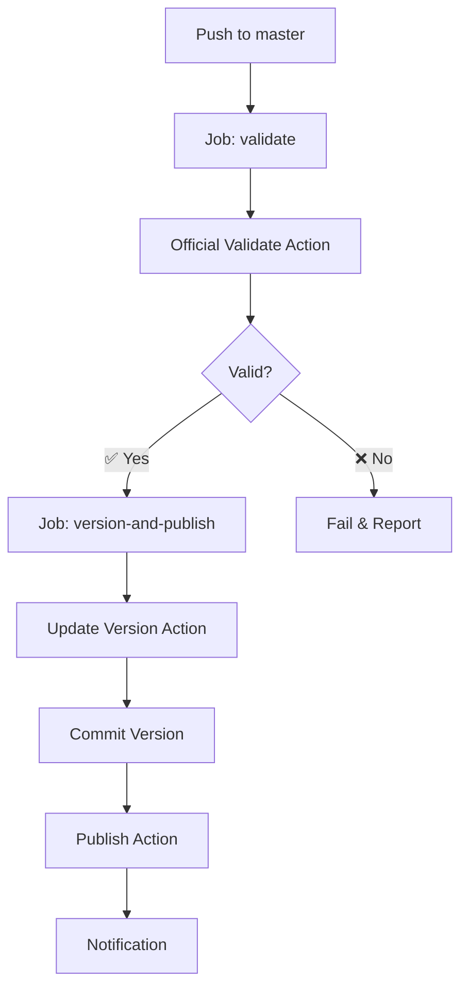

# 📖 Guide Officiel de Publication - Universal Tuya Zigbee

**Date:** 2025-10-11  
**Version App:** 2.1.51  
**Basé sur:** [Documentation Officielle Homey](https://apps.developer.homey.app/app-store/publishing)

---

## 🎯 Vue d'ensemble

Ce guide documente le **processus officiel** de publication selon la documentation Homey, en remplacement des approches complexes précédentes.

### ✅ Changements Majeurs

| Avant | Maintenant |
|-------|------------|
| Scripts PowerShell complexes | ✅ Actions officielles GitHub Marketplace |
| Gestion manuelle des prompts | ✅ Workflows automatisés |
| Buffer workarounds | ✅ API officielle Homey |
| Multiples tentatives | ✅ Processus standard validé |

---

## 📦 Actions Officielles Utilisées

### 1. **Homey App Validate**
```yaml
uses: athombv/github-action-homey-app-validate@master
```
- **Source:** https://github.com/marketplace/actions/homey-app-validate
- **Purpose:** Valide l'app selon les standards Homey
- **Niveaux:** debug, publish, verified

### 2. **Homey App Update Version**
```yaml
uses: athombv/github-action-homey-app-update-version@master
with:
  version: patch  # ou minor, major
  changelog: "Description des changements"
```
- **Source:** https://github.com/marketplace/actions/homey-app-update-version
- **Purpose:** Incrémente version + génère changelog
- **Versioning:** Semantic (patch/minor/major)

### 3. **Homey App Publish**
```yaml
uses: athombv/github-action-homey-app-publish@master
with:
  personal-access-token: ${{ secrets.HOMEY_PAT }}
```
- **Source:** https://github.com/marketplace/actions/homey-app-publish
- **Purpose:** Publie sur Homey App Store
- **Requiert:** Secret `HOMEY_PAT`

---

## 🚀 Workflow Principal

### Fichier: `.github/workflows/homey-official-publish.yml`

**Déclencheurs:**
- ✅ Push automatique sur `master`
- ✅ Manuel via GitHub UI (`workflow_dispatch`)

**Processus:**



**Étapes détaillées:**

1. **Validation**
   ```bash
   athombv/github-action-homey-app-validate@master
   Level: publish
   ```

2. **Versioning**
   ```bash
   athombv/github-action-homey-app-update-version@master
   Type: patch (auto) ou manuel
   Changelog: Généré auto depuis commit
   ```

3. **Publication**
   ```bash
   athombv/github-action-homey-app-publish@master
   Auth: HOMEY_PAT secret
   ```

4. **Commit**
   ```bash
   git commit "chore: bump version to vX.X.X [skip ci]"
   git push origin master
   ```

---

## 🔑 Configuration Requise

### Secret GitHub: `HOMEY_PAT`

**Comment l'obtenir:**

1. **Aller sur Homey Developer Dashboard**
   ```
   https://tools.developer.homey.app
   ```

2. **Naviguer vers Personal Access Tokens**
   ```
   Account → Personal Access Tokens
   ```

3. **Créer nouveau token**
   - Click "Create new token"
   - Copier le token généré

4. **Ajouter dans GitHub Secrets**
   ```
   Repository Settings
     → Secrets and variables
       → Actions
         → New repository secret
           Name: HOMEY_PAT
           Value: <votre token>
   ```

**⚠️ Important:**
- Ne jamais committer le token dans le code
- Le token donne accès à votre compte développeur
- Peut être révoqué et régénéré si nécessaire

---

## 📝 Utilisation Pratique

### Méthode 1: Publication Automatique (Recommandée)

**Étape 1: Développement Local**
```bash
# Installer dépendances
npm install

# Valider avant commit
npx homey app validate --level publish
```

**Étape 2: Commit & Push**
```bash
git add .
git commit -m "feat: add support for new temperature sensors"
git push origin master
```

**Étape 3: GitHub Actions**
- ✅ S'exécute automatiquement
- ✅ Valide l'app
- ✅ Incrémente version (patch)
- ✅ Publie sur Homey

**Étape 4: Dashboard Homey**
1. Aller sur https://tools.developer.homey.app
2. Apps SDK → My Apps
3. Universal Tuya Zigbee v2.1.52 (nouvelle version)
4. Choisir:
   - **Test Release** (pas de certification)
   - **Live Release** (certification Athom)

---

### Méthode 2: Publication Manuelle

**Via GitHub UI:**

```
GitHub Repository
  → Actions
    → Official Homey App Store Publication
      → Run workflow
        Branch: master
        Version type: patch/minor/major
        Changelog: "Custom message"
```

**Via Script PowerShell:**

```powershell
# Publication standard
.\scripts\automation\publish-homey-official.ps1

# Version mineure
.\scripts\automation\publish-homey-official.ps1 -VersionType minor

# Avec changelog personnalisé
.\scripts\automation\publish-homey-official.ps1 `
  -Changelog "Added 20 new device models"

# Dry run (test)
.\scripts\automation\publish-homey-official.ps1 -DryRun
```

**Via CLI Homey:**

```bash
# Méthode officielle la plus simple
cd "c:\Users\HP\Desktop\homey app\tuya_repair"
npx homey app publish
```

---

## 🎯 Flux de Publication Complet

### Phase 1: Draft → Test

```
1. GitHub Actions publie → DRAFT créé
2. Dashboard Homey → Voir nouveau build
3. Promouvoir vers TEST (manuel)
4. Test URL activée: https://homey.app/a/com.dlnraja.tuya.zigbee/test/
```

**Avantages Test:**
- ✅ Pas de certification nécessaire
- ✅ URL privée pour beta-testeurs
- ✅ Peut être mis à jour instantanément
- ✅ Permet tests réels avant certification

### Phase 2: Test → Certification

```
1. Dashboard → Submit for certification
2. Athom Review (1-3 jours ouvrables)
   - Vérification App Store Guidelines
   - Tests fonctionnels basiques
   - Vérification assets/images
3. Notification approval/rejection
```

**Checklist Certification:**
- [ ] App passe `homey app validate --level publish`
- [ ] Description claire et user-friendly
- [ ] Images de qualité (75x75, 500x500)
- [ ] Pas de sur-promesses marketing
- [ ] Respecte guidelines Athom

### Phase 3: Live Release

```
1. After approval:
   - Auto-publish (si configuré)
   - OU promotion manuelle
2. Live URL activée: https://homey.app/a/com.dlnraja.tuya.zigbee/
3. Visible dans Homey App Store public
4. Disponible pour tous les utilisateurs
```

---

## 🔍 Validation Locale

### Commandes Essentielles

```bash
# Validation publish (requis)
npx homey app validate --level publish

# Validation debug (développement)
npx homey app validate --level debug

# Validation verified (développeurs certifiés)
npx homey app validate --level verified

# Build sans publication
npx homey app build
```

### Niveaux de Validation

| Niveau | Usage | Requirements |
|--------|-------|--------------|
| **debug** | Développement local | Minimal (id, version, name) |
| **publish** | Publication Homey Pro | Standard (images, category, etc.) |
| **verified** | Homey Cloud | Stricte (platforms, connectivity) |

---

## ✅ Checklist Pre-Publication

### Avant chaque push sur master:

- [ ] `npx homey app validate --level publish` ✅ PASSED
- [ ] Tous les drivers ont images (small.png, large.png)
- [ ] CHANGELOG.md mis à jour avec changements
- [ ] README.md décrit fonctionnalités actuelles
- [ ] Pas de credentials hardcodés dans le code
- [ ] `.gitignore` à jour (node_modules, .homeybuild, etc.)
- [ ] Git clean (pas de fichiers non commités)

### Configuration GitHub:

- [ ] Secret `HOMEY_PAT` configuré
- [ ] Workflows dans `.github/workflows/`
- [ ] Permissions `contents: write` définies

---

## 🐛 Dépannage

### Erreur: "Validation failed"

**Diagnostic:**
```bash
npx homey app validate --level publish
```

**Causes fréquentes:**
1. Images manquantes ou mauvaise taille
2. Clusters Zigbee en string au lieu de numeric
3. Capabilities invalides
4. Battery types incorrects (doit être: CR2032, AA, PP3, etc.)

**Solution:**
- Lire attentivement le message d'erreur
- Corriger les problèmes identifiés
- Re-valider avant push

### Erreur: "Authentication failed"

**Causes:**
- Secret `HOMEY_PAT` non configuré
- Token expiré
- Token incorrect

**Solutions:**
1. Vérifier GitHub Secrets
2. Régénérer token sur Homey Dashboard
3. Mettre à jour secret GitHub

### Erreur: "Build already exists"

**Causes:**
- Version non incrémentée
- Build précédent encore en traitement

**Solutions:**
1. Attendre 2-3 minutes
2. Nettoyer cache: `rm -rf .homeybuild .homeycompose`
3. Incrémenter manuellement si nécessaire

### Workflow ne se déclenche pas

**Vérifications:**
1. GitHub Actions activé dans Settings
2. Workflow file bien dans `.github/workflows/`
3. Syntaxe YAML correcte (pas d'erreurs lint)
4. Permissions repository appropriées

---

## 📊 Monitoring

### GitHub Actions

**Accès:**
```
Repository → Actions → Choose workflow → View run
```

**Indicateurs de succès:**
- ✅ Tous les jobs verts
- 📝 Summary tab avec version info
- 🔗 Links vers Dashboard Homey

**En cas d'échec:**
- ❌ Job rouge
- 📋 Logs détaillés dans job
- 🔍 Error messages pour debug

### Homey Developer Dashboard

**URL:**
```
https://tools.developer.homey.app/apps/app/com.dlnraja.tuya.zigbee
```

**Sections:**
- **Builds** - Tous les builds uploadés
- **Test** - Gestion releases Test
- **Live** - Gestion releases Live
- **Certification** - Statut reviews Athom

---

## 📚 Ressources Officielles

### Documentation Homey

- **Publishing Guide:** https://apps.developer.homey.app/app-store/publishing
- **App Store Guidelines:** https://apps.developer.homey.app/app-store/guidelines
- **SDK Reference:** https://apps.developer.homey.app
- **Validation Levels:** https://apps.developer.homey.app/app-store/publishing#requirements

### GitHub Marketplace

- **Validate Action:** https://github.com/marketplace/actions/homey-app-validate
- **Version Action:** https://github.com/marketplace/actions/homey-app-update-version
- **Publish Action:** https://github.com/marketplace/actions/homey-app-publish

### Developer Tools

- **Dashboard:** https://tools.developer.homey.app
- **App Store:** https://homey.app/apps
- **Test URL:** https://homey.app/a/com.dlnraja.tuya.zigbee/test/
- **Live URL:** https://homey.app/a/com.dlnraja.tuya.zigbee/

---

## 📁 Fichiers Importants

### Workflows GitHub Actions

```
.github/workflows/
├── homey-official-publish.yml    ⭐ Workflow principal (recommandé)
├── homey-validate.yml            Validation continue (PRs)
├── OFFICIAL_WORKFLOWS_GUIDE.md   Guide complet workflows
└── WORKFLOWS.md                  Documentation générale
```

### Scripts Locaux

```
scripts/automation/
└── publish-homey-official.ps1    Script PowerShell de publication
```

### Référentiels

```
references/
└── github_actions_official.json  Référentiel technique complet
```

---

## 🎯 Prochaines Étapes

### Immédiat

1. **Configurer HOMEY_PAT** (si pas déjà fait)
2. **Valider app localement**
   ```bash
   npx homey app validate --level publish
   ```
3. **Tester workflow** via commit simple

### Court Terme

1. **Première publication Test**
   - Push vers master
   - Vérifier GitHub Actions
   - Promouvoir vers Test sur Dashboard

2. **Tests communautaires**
   - Partager Test URL avec beta-testeurs
   - Collecter feedback
   - Corriger bugs identifiés

### Moyen Terme

1. **Soumission certification**
   - Après tests concluants
   - Submit for certification via Dashboard
   - Attendre approval Athom

2. **Live release**
   - Après certification
   - Promouvoir vers Live
   - Annonce sur forum Homey Community

---

## 📞 Support

### Issues GitHub
https://github.com/dlnraja/com.tuya.zigbee/issues

### Forum Homey Community
https://community.homey.app/t/app-pro-universal-tuya-zigbee-device-app-lite-version/140352/

### Contact Direct
Dylan Rajasekaram - Maintainer du projet

---

**Dernière mise à jour:** 2025-10-11  
**Version du guide:** 1.0.0  
**Statut:** ✅ Production Ready
